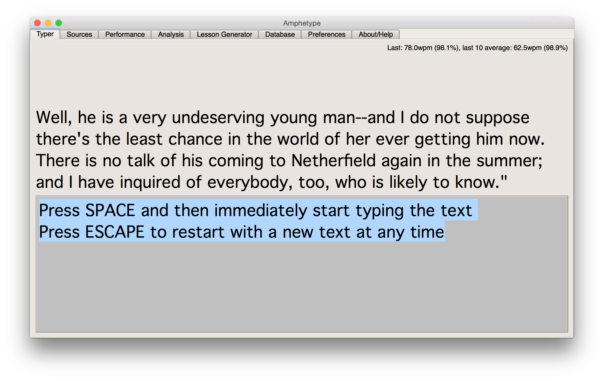

Adventures in Keyboarding, Part III
###################################
:date: 2016-12-12 17:47
:status: published

`Part I <https://patricksanan.com/adventures-in-keyboarding-part/>`__
`Part II <https://patricksanan.com/adventures-in-keyboarding-part-ii/>`__

I am back to Qwerty.

Why?

1. **The standard is valuable**. As I acknowledged before, refusing to use the standard has obvious downsides, but it became excruciating when I had a period at work that involved helping people install software on their machines. Being able to type well on someone else's machine is very useful. It happens more than I would have assumed.

2. **Qwerty is actually not so bad**. I think I believed too much of the hype about the importance of optimal layout (because it's a fun thing to nerd out about). J, K, F, and ; seem to be squatting on prime real estate, but none of the common letters are in really bad places (except arguably T). With the possible exception of EV, I don't feel like any common movements are uncomfortable. All in all, Qwerty's advantage as the standard compensates for its minor inefficiencies.

3. **This is a chance to learn again from zero**, as I have been using Workman exclusively for long enough to completely lose any Qwerty habits. Part of my original motivation for choosing an alternate layout was to leave those habits behind, and now I have done so.

4. **I have a different idea of how to become good at typing**, which I want to try to apply more thoughtfully. `Peter's Online Typing Course <http://www.typing-lessons.org/>`__ is the best I've seen, still. No mistakes. Speed is your enemy. Dare yourself to go slowly with 100% accuracy and an even pace. Games which challenge you to improve your speed are fun, but I think actually counter-productive. 100% accuracy at 70 WPM is more useful (to me, anyway) than 99% accuracy at 110 WPM. 130 WPM after a few gibberish tries is useful only in a game.

For more advanced practice, `Amphetype <https://code.google.com/archive/p/amphetype/>`__ is the best tool I've found, in particular because it lets you set a lower bound (I use 99%) on accuracy to complete an exercise, and can automatically generate lessons to review troublesome words. It's also an extremely customizable, open-source  tool which you can run on your own machine.

|Bildschirmfoto 2017-01-03 um 12.16.57.png|

