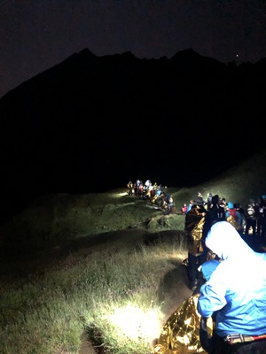
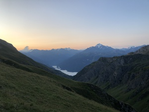
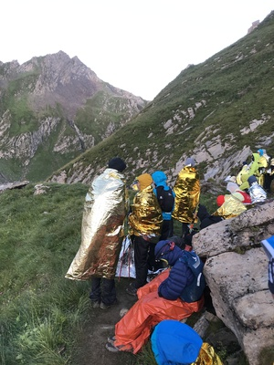
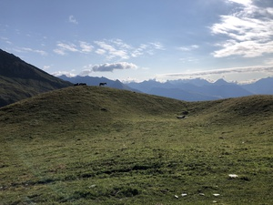
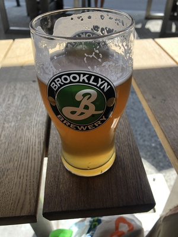

Category: Trip Reports
Date: 2021-08-24
Title: TDS

The ["Sur les Traces des Ducs de
Savoie"](https://utmbmontblanc.com/en/page/22/22.html), understandably
usually referred to as "TDS", is one of the series of trail races
leading up to the [Ultra Trail du Mont Blanc
(UTMB)](https://utmbmontblanc.com/en/live). It is a little shorter than
the main UTMB race, at 145 km with about 9000 m of climbing, but is on
more technical trails.

Running was my birthday present. I'd registered as a backup for
[VDA]({filename}2021_07_09_VDA.md); that had gone well and I
hadn't really been expecting to be able to take time away from the
family, but luckily the family was very generous!

I didn't end up finishing the race, as the course was closed in the
aftermath of a fatal accident for one of the runners. It was a sad day
for the ultra/trail running community. Read more [on
iRunFar](https://www.irunfar.com/2021-tds-runner-death) or [in UTMB's
press
release](https://utmbmontblanc.com/documents/CP/2021/CP%2025%2008%202021%20-%20EN.html)
.

I had planned for this race to be different than usual. It was very much
like the [VDA]({filename}2021_07_09_VDA.md), which I'd just run,
but a little less extreme in every way: a little less distance, a little
less technical, a little less elevation change, and an almost-full moon
instead of new moon. It was slightly more difficult in having more
widely-spaced and less well-stocked aid stations.

UTMB is a giant circus, so the race didn't have a flavor of the
unknown, adventure, or wilderness. It's hard to think of yourself as in
nature with so many people, cameras, helicopters, Instagram bros,
etcetera. You can find as much information about the route as you care
to. So, I thought that I'd try to run this one "fast" if possible,
mainly by trying to eliminate some small time sinks, such as taking
photos, getting anything out of my drop bag (assuming ideal conditions),
or napping (totally doable as I was shooting to run through "only" one
night).

> [{width="300px"}](images/2021_08_24_TDS/circus.jpg)
>
> The finish line in Chamonix for all the UTMB festival races, including
> the TDS, and the start line for the UTMB itself.

I wasn't feeling great leading up to the race, though. I felt tired and
bleary as I took the train to France and checked into my hostel
(thankfully my gamble on a cheap single room paid off). I had enjoyed
running the short, 7.4 km Forchlauf race in Zurich a few days before the
race, thinking that this would be a fun tune-up, but this was probably a
mistake. I run fast so rarely that even though it took just over half an
hour, it left me feeling less than fully recovered before the TDS.

The race started in waves, as a COVID-related precaution. There was a
delay in starting, so the waves were only 7 minutes apart, instead of
the planned 15. Nonetheless, the combination of this and a few
kilometers before any single-file trails meant that conga lines weren't
as bad as you'd think in such a big race.

I started close to the front of the second wave of five. I kept up with
the crowd, which was a mistake. This was too fast relative to my
fitness. I didn't enjoy the crowds - a couple of people pushed by on
downhills to save 5 seconds, and there were too many cameras, and one
horrible drone, in my face.

I reached Lac Combal after about 2 hours, 30 minutes ahead of my goal
for a 30 hour finish. I kept pushing pretty hard to try and make the Col
Chavannes, the high point of the course at 2603 m, before the weather
did. We'd been informed at the start to expect rain and possibly a
storm, and we got it. I started fast (for me) on the descent from the
col, an endless 10% descent on a fire road during which I felt myself
slowing and started getting passed. It started raining near the bottom.
I was very lucky to be next to a farm building with an overhanging roof
and a concrete step to sit on, so I managed to put on my jacket, rain
pants, and headlamp in comfort.

At this point, I heard someone say "No way!" and there was Francesco!
I was shocked by this because Francesco is fast (he finished in the top
100 out of over 1500). This tells you something about how I overextended
on the first section. Francesco said we'd see each other later, but
unfortunately this wasn't to be.

There were a few lightning flashes - the shortest delay to the thunder
was about 7 seconds, meaning 2-3 km away. Fortunately these subsided
before we approached the next col.

I was feeling gross by the time I reached the bottom of the descent and
started back up to the Col du Petit St. Bernard. I had an upset stomach
and it was wet and miserable. My glasses fogged up and my rain gear just
seemed to be another damp layer. It rained and rained and got dark. I
felt smug as I passed many people who had waited until total darkness to
put on their headlamps and were now scrambling in their packs in the
rain. Near the aid station was a very steep section which had become
quite muddy - I slipped a couple of times as I pushed as hard as I could
do not slow down the crowd behind me.

The aid station began with a hop across a giant puddle. I dearly wished
for the delicious tortilla they'd had at the VDA, but settled for a cup
of broth and some bread.

The descent to Bourg Saint Maurice was long and tiring, but not as muddy
as I'd feared. I had wondered about the need for the drinks-only aid
station at Seez, but now I saw why it was there, as the ensuing easy 2.9
km crossing the city to the main aid station seemed interminable. I felt
unhappy when I got to the main aid station a bit after 11 pm, but was
actually very close to my target time, thanks to my speedy start. I then
made a another mistake - I hadn't expected any "real" food here (no
"warm meal" promised), and so had already loaded up my plate with
suboptimal stuff (cheese and crackers, cake) when I saw that they did in
fact have rice and pasta, which were exactly what I needed. I was too
ashamed to throw away the food I had just gotten, and took only a cup of
broth instead. I got some bread and crackers down, but it wasn't the
big recharge I knew I needed.

I felt very tired starting out of the aid station, which discouraged me
further as I knew that I was beginning the hardest segment of the
course: 2000 m of climbing to a pass, the Passeur de Pralognan, over
2500m. The first few kilometers of this were very steep, over 25% grade,
and I crawled, being passed by many people. Things improved after the
Fort de la Platte, stunning under the full moon in the now-clear skies.
I was still moving slowly and getting passed, but at least wasn't quite
as miserable.

I felt myself coming back into my own a little bit on the more-technical
descent and ascent before the pass. As before, the more interesting
trail gave me something to think about besides being tired. The descent
on the other side of the pass is considered the technical crux of the
route, involving carefully descending a steep trail with chains. The
start time of the TDS has changed several times; this time, the
technical crux was at night. This makes that section more difficult but
avoids having the biggest climb (from the low point on the course)
during the heat of the day.

I was maybe beginning to actually enjoy myself, a first on the route, as
I came around the corner and was momentarily thrilled to see I'd
reached the pass. I realized something was amiss. A large crowd of
people lined up below the crest of the ridge and several more huddled
around a fire, most of them wrapped in space blankets. I heard that
there had been an accident on the other side of the pass, which had
caused the backup. I had begun to doubt my chances of achieving my 30
hour goal, so I wasn't too heartbroken at the thought that at the
current rate I'd have to add another 2-3 hours to my time by sitting
here. The staff at the head of the line/crowd would slowly but steadily
scan people's bibs to register them at the check point, and send them
down the pass. However, the inflow rate was much higher than the
outflow, and very soon the trail backed up out of sight with runners in
their space blankets.

I was happy to be near the fire, as my wet feet were very cold. I
didn't have a thermometer but it was apparently just above freezing,
though fortunately clear and not windy.

I had arrived somewhere around 3 am, and after a little longer than an
hour of waiting, the crowd ahead had thinned enough that I decided to
leave the group huddled near the fire and join the main queue, which
hadn't gotten shorter but was now more of a line than a crowd. I handed
out some Haribo gummie bears. I then had a confusing encounter. As I was
trying to re-wrap my space blanket around myself, a woman asked me,
"Are you using that? Can I use it?". I had thought it was obvious I
was using the blanket but gave it to her assuming she was having a hard
time in the cold, and I was feeling OK.

I guessed about an hour of waiting in the line would do it. Only a few
minutes later, at 4:20 or so, though, my hopes were dashed as the
checkpoint staff told us that the race was cancelled and that we should
return to Bourg St. Maurice. I wasn't deeply disappointed in the
moment - it had been one of the more miserable races and this point in
the night is usually the worst in terms of morale. An honorable
discharge, for reasons completely out of my control, seemed fine.

Relieved of the demands of trying to finish the race, there followed a
period of relative levity. We didn't know yet that the accident had
been fatal. We were now at the back of the long line of people going
down, and I figured we'd now leisurely wander back to the aid station,
take the bus back to Chamonix, and get croissants and coffee. The woman
who had taken my space blanket had disappeared, and I didn't remember
anything about her. I called out asking for my blanket, to no response,
but figured it didn't really matter as I had another one at home.
Wrong.

It soon became clear that the reversed line was moving very, very
slowly. We didn't get information about why, which became increasingly
frustrating as we got colder. We could see the headlamps below making
their way back to the Col de la Forclaz, but they got more and more
thinly spaced, suggesting a bottleneck out of sight. So we sat. I was
definitely missing my space blanket now.

> [{width="300px"}](images/2021_08_24_TDS/blankets_night.jpg)
>
> Waiting before sunrise.

 

> [{width="300px"}](images/2021_08_24_TDS/sunrise.jpg)
>
> Unfortunately, the sun rose on the other side of the pass.

We sat and sat, every few minutes moving a bit down the trail. The sun
rose. Finally we reached the bottleneck at the likely place - a short,
class 2 scrambling section of a few steps down had three mountain guides
who had fixed a rope (at three points, one of which was the middle
guide) and were instructing people to go across, spaced out. This
section had required hands but was easy to ascend - it was a little
trickier going down, especially with all the mud from several hundred
runners' feet.

I was a little less grumpy once I saw this, because even though we'd
sat around for hours without much idea of what was happening, people had
been working to get everyone down safely, if slowly. I am very thankful
that the weather was not worse - that may have forced a decision to
allow people to descend more quickly. I've done enough scrambling in
less-than-ideal situations to be confident in doing it, but I doubt that
was true in general for the runners, especially after covering quite a
lot of the course and being wet and cold.

> [{width="300px"}](images/2021_08_24_TDS/blankets_day.jpg)
>
> After sunrise, still waiting.

I very leisurely descended and was one of the last ones back to Bourg
St. Maurice. It was nice to have the place mostly to myself. I saw some
nice views, some cows, some lakes, and the fort from above.

> [{width="300px"}](images/2021_08_24_TDS/horse.jpg)
>
> Enjoying the comparative solitude on the walk back down to Bourg Saint
> Maurice.

From talking to some Americans on the way down, I learned that the
accident had been a fall and that the runner had died from his injuries.
In the initial reporting, it was somehow implied that we had been turned
around because of the severity of the accident. That's not quite true,
or it would not have taken almost 4 hours to make the decision, long
after the helicopter had evacuated the victim. Rather, we were turned
around because the pass is a major bottleneck in the route (and there is
a typically a line there, even under normal circumstances), and the
rescue operation blocked the course for long enough to create a backup
of hundreds of people that couldn't be resolved. Medical emergencies
and helicopter evacuations are not uncommon in this part of the world.
I'd already seen ambulances more than once during the race, and there
was another helicopter evacuation later during the race, on the Col du
Tricot.

I think the correct decisions were made, but I detected a bit of
ass-covering to avoid people asking too many questions about how one
safely runs a race on course with such a bottleneck at 2500m, with 1500
people, with another bottleneck on the retreat route from the first one.
I should point out that in previous years, due to bad weather, the
course has been rerouted to a boring road to avoid this col, and I am
sure they would have done so this year if conditions had been worse.
While things were wet, we had clear skies, no wind, and non-threatening,
if uncomfortable, temperatures. The people making the calls seem to have
correctly assessed the relative risks, but I think that this depended on
accurate weather forecasts, which I don't think can always be assumed
to exist in the mountains.

As trivial as it ultimately is, I was happy that our original "Did Not
Finish" (DNF) designations were later converted to finisher status of a
new, shorter variant of the route, dubbed "TDS - Bourg-Saint-Marie".
This was nice for our egos (DNF typically signifies that you abandoned
or didn't finish in time) and let us collect our finisher's shirts
(though I'd already left Chamonix). It was also of practical benefit;
to enter ultras, one often has to have finished other ultras, and this
new variant could be used for those purposes (though not as a [Western
States](https://www.wser.org/) qualifier).

\[Update, 2022-01-07: I've been impressed with how organized things
have been in the wake of the cancellation. We were given entry into the
2022 race, if desired, and I'm happy that the start time is now
midnight. That's tough, as far as sleep deprivation goes (in [my
experience]({filename}2019_09_13_100m.md)), but it fits the
course - everyone will do the crux section in the daylight, and most
will be able to do the big climb before it gets too hot. Of course,
risks remain with a large number of runners, but given that the
organization has demonstrated that they will reroute when conditions
dictate, I think these would be acceptable to most entrants.\]

So, what to say? It was certainly the least fun (including [type 2
fun](https://kellycordes.com/2009/11/02/the-fun-scale/)) race I've ever
run. But that isn't the only measure of an experience. I'm very
impressed and proud that everyone involved here acted with humanity and
rationality - runners, organizers, even the media (bullshit SEO
websites, which just copy-paste press releases, excluded). No one
panicked, people were kind to one another, and I think we'll
(eventually) be stronger, afterwards. We all give our condolences to the
friends and family of the runner we lost.

> [{width="300px"}](images/2021_08_24_TDS/beer.jpg)
>
> Na zdraví.
