Category: Trip Reports
Date: 2028-09-07
Title: UTMR DNF

I dropped out of the 2023 UTMR 170k after about 50k.

Failed attempts are better teachers than successful ones, so in that spirit, here's an extended "lessons learned".

## Train!

It was a very bad year, trainingwise. I had a couple of injuries that prevented me from training much, and all of my lead-up races were DNSs. I also got sick more than usual, and had more work stress than usual. (I think the stress directly affected my health - I got sick more easily and was more bothered by Psoas tendonitis(?) than I otherwise would have been).

You have to run a lot to make this work. Even in years where I thought I wasn't running much,
I was running more than this year.

The standard advice is true - the most important things for a really long event are
0) Care enough to do any of this
1) Don't get injured
2) Run a lot
3) Do long runs (including pre-event races and long mountain routes)
4) .. a bunch of stuff I usually don't get to, like tempo and speed work and muscular endurance ..

## Don't be afraid to drop down

My biggest mistake was not changing races. I should have made the call to do this much earlier, when training plans didn't go well. But I kept an irrational hope. Because a certain degree of irrationality has served me well in the past. The whole point is doing something you're not quite sure you can do. But as you get older, you get smarter, and as in other areas of life, an ability to push myself isn't the bottleneck anymore.

Beware the hobgoblin of small minds.

I probably also should have asked to bend the rules later to be transferred. I don't like the idea of this, but I think as long as such a request is seen as risky and a bit rude, it doesnt' violate the spirit of the rules (needing to have stable participant counts so the race can be planned) too much.

This is an important intersection of the "reset"  and "efficiency" mantras, I guess. It's not just about forgetting the pain before and pushing more, it's about acting optimally in the current situation, not some imaginary one.

During the race itself, don't be afraid to readjust to reality. Of course, it's not so easy to know what "reality" is, when often the correct thing is to ignore your brain telling you things like the objective truth that you cannot finish the race, even though you can finish.
This happened during UTMB. If I'd cared more, I think that I might have done this at Trockener Steg - just kept going slowly after the break there, instead of going home.

That's bring me to the next point:

## You really have to want it

So I though "hey, I'll give it a shot.". Or "I'll enjoy the course".

I didn't really care, though. I didn't really want it.
I made too much peace with not finishing, so I didn't.

That said, pushing yourself to the quitting point really exposes things you can do
to make life less miserable, so I'll now list some of those!

## Rest and acclimatize before

I didn't arrive at the start in a good state, even given my lack of training. I decided to save a buck by sleeping in a tent the night before. This almost worked well, but there was some sort of clanking flagpole all night, and then a nice 1-2km uphill hike with an enormous pack, to the start.

More important is to spend some time at altitude before a race like this. That would have made a difference.

Also, rest before races in teh past has certainly helped. This time, I came straight from work and was stressed.

Splurge for a vacation day or two beforehand, and for the hotel if you can afford it, even if it's only for a few hours.

Don't be rushing to eat and poop beforehand. Get up and drink coffee if you need to.

## Think harder about your gear

I tend to think I've mostly got this under control, but then again when you fail, it shows you weaknesses you didn't consider important.

I should have spent longer shaving off grams. I didn't devote much energy to picking the lightest version of everything (especially given the amazing forecast) and this race featured a lot of "extra" junk beyond what would be on my personal packing list for safety.

A big mistake was not keeping my electrolyte/caffeine pills on me. I put these in the first drop bag, to save some weight on the first leg, but then didn't see them, as they were hidden amonsgt some extra gels! These should be considered emergency gear, always to be kep on you. It was a big psychological blow when I realized I'd forgotten these, after leaving Zermatt.

I should shell out for a powerful, light headlamp, even if it means buying a proprietary battery pack or two.

I should actually find a good way to deal with my glasses. I often end up running with them in my hand or put them loose into a pocket, because they fog up.

One thing that worked well: soaking my hat in foundtains in the hot temperatures and intense sun.

## RUn the numbers

I usually make a spreadsheet with target splits. I didn't this time, but which I had. The biggest climb was where I quit, and though I was crawling, to be honest I probably wasn't going that much slower than my split would have been. This can put those slow parts in perspetive and keep psych up.

Related: don't skimp on researching the route. Discovering it on the day is fun and all, but knowing things like what the bail situation could reduce stress, so take the time to do it. (This probably also helps with visualizing, and making you Want It)

## Going out fast isn't that crazy

I've never actually gone out slow in a race. It sucked. It wasn't really any less tiring, you're stuck in a crowd, and it was longer and slower.
It's trivial to let people pass you, but on most of the initial terrain on this course, it was very hard to pass without a lot of effort.

## Enjoy the overall experience!

This all sounds very negative, and I just said how "enjoying it" was a bad strategy, but I actually had a great weekend!

I'm glad I did it, after all the mistakes I made. As usual in life, the best part was actually the people
around me.
The day afterwards, getting a full night's sleep in the rental apartment, volunteering at an aid station, and having a nice little hike afterwards,
were fantastic. Having that day makes me sort of glad I quit embarassingly early.
The staff at this race are really, really nice, and I will be back to race and/or volunteer.
Grächen is lovely.

I came out of the race psyched to train to broaden my skillset and focus on point "4" above that I rarely get to.
Going slow sucks. I want to learn to go faster.
Once a current bout of illness is done, that's what I'm going to do, and hopefully my next trail ultra will
be more enjoyable because I'll have more of a base of running efficiency, strength, and muscular endurance.

I note I've actually said this after several races in teh past, but the lure of longer and longer distance, and
not enough time to do everything, has kept me on the long and slow. Unless I get into Tor des Geants, though,
I think I'm losing in terest in the long for long's sake (much as with climbing, I lost interest in getting to the top
for its own sake at a certain point).

<a href="https://www.strava.com/activities/9802449880">Activity on Strava</a>.

<figure>
<a href="images/2023_09_07_UTMR_DNF/01.jpg">
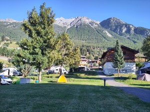
</a>
<figcaption><em>images/2023_09_07_UTMR_DNF/01.jpg</em></figcaption>
</figure>
<figure>
<a href="images/2023_09_07_UTMR_DNF/02.jpg">
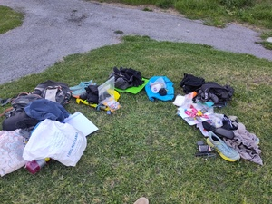
</a>
<figcaption><em>images/2023_09_07_UTMR_DNF/02.jpg</em></figcaption>
</figure>
<figure>
<a href="images/2023_09_07_UTMR_DNF/03.jpg">
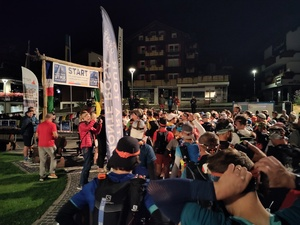
</a>
<figcaption><em>images/2023_09_07_UTMR_DNF/03.jpg</em></figcaption>
</figure>
<figure>
<a href="images/2023_09_07_UTMR_DNF/04.jpg">
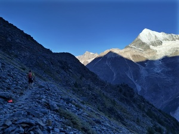
</a>
<figcaption><em>images/2023_09_07_UTMR_DNF/04.jpg</em></figcaption>
</figure>
<figure>
<a href="images/2023_09_07_UTMR_DNF/05.jpg">
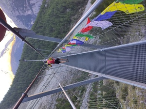
</a>
<figcaption><em>images/2023_09_07_UTMR_DNF/05.jpg</em></figcaption>
</figure>
<figure>
<a href="images/2023_09_07_UTMR_DNF/06.jpg">
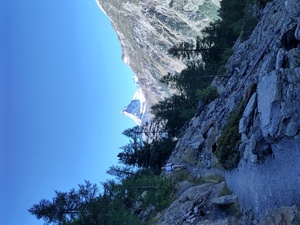
</a>
<figcaption><em>images/2023_09_07_UTMR_DNF/06.jpg</em></figcaption>
</figure>
<figure>
<a href="images/2023_09_07_UTMR_DNF/07.jpg">
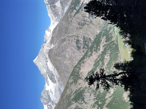
</a>
<figcaption><em>images/2023_09_07_UTMR_DNF/07.jpg</em></figcaption>
</figure>
<figure>
<a href="images/2023_09_07_UTMR_DNF/08.jpg">
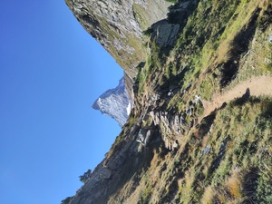
</a>
<figcaption><em>images/2023_09_07_UTMR_DNF/08.jpg</em></figcaption>
</figure>
<figure>
<a href="images/2023_09_07_UTMR_DNF/09.jpg">
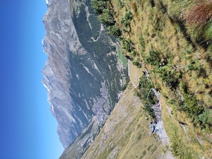
</a>
<figcaption><em>images/2023_09_07_UTMR_DNF/09.jpg</em></figcaption>
</figure>
<figure>
<a href="images/2023_09_07_UTMR_DNF/10.jpg">
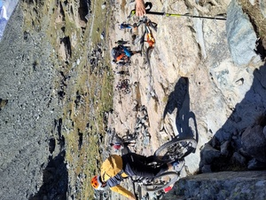
</a>
<figcaption><em>images/2023_09_07_UTMR_DNF/10.jpg</em></figcaption>
</figure>
<figure>
<a href="images/2023_09_07_UTMR_DNF/11.jpg">
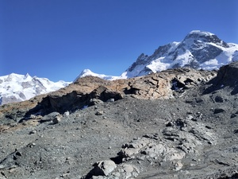
</a>
<figcaption><em>images/2023_09_07_UTMR_DNF/11.jpg</em></figcaption>
</figure>
<figure>
<a href="images/2023_09_07_UTMR_DNF/12.jpg">
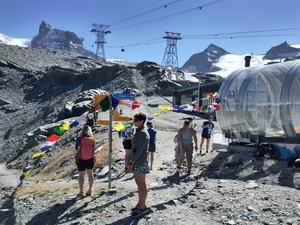
</a>
<figcaption><em>images/2023_09_07_UTMR_DNF/12.jpg</em></figcaption>
</figure>
<figure>
<a href="images/2023_09_07_UTMR_DNF/13.jpg">
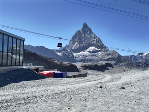
</a>
<figcaption><em>images/2023_09_07_UTMR_DNF/13.jpg</em></figcaption>
</figure>
<figure>
<a href="images/2023_09_07_UTMR_DNF/14.jpg">
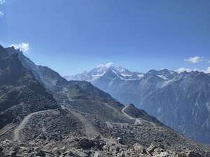
</a>
<figcaption><em>images/2023_09_07_UTMR_DNF/14.jpg</em></figcaption>
</figure>

