Category: Trip Reports
Date: 2022-08-26
Title: Swiss Cantonal Highpoints

<b>5/26 Cantons</b>

After a recent perusal of [my favorite website](http://countryhighpoints.com/),
I was curious about the list of the highest points in each
Canton in Switzerland. The 26 cantons (Federal states) have a wide variety of highpoints,
including some serious mountains, given how much of the
country is Alps, and how many cantons are squeezed in;
my home state of California is ten times the area of the whole country!

There are 26 points to reach. Säntis is shared by both Appenzell Innerrhoden
and Appenzell Ausserrhoden, but Thurgau may have two similarly-high points,
close together, so one should tag both.  It's a great list for inspiration, as
it includes some trail-runnable peaks, some proper mountaineering objectives,
and some hills one could bike to.

As of August 2023, I was surprised that I had already climbed 4 and had passed
by a few others without tagging the summits. It was fun to look back through my
photos and add a few here, and I'll update this post if I climb any of the
other highpoints!

# The peaks
<ul>
<li> <a href="https://www.peakbagger.com/list.aspx?lid=12260">on Peakbagger.com</a></li>
<li><a href="https://en.wikipedia.org/wiki/Category:Highest_points_of_Swiss_cantons">as a Category on English Wikipedia</a></li>
<li><a href="https://de.wikipedia.org/wiki/Liste_der_h%C3%B6chsten_Berge_der_Schweizer_Kantone">as a nice page on German Wikipedia</a></li>
</ul>

## The close ones

* (Done!) Zurich - Schnebelhorn
* (Done!) Appenzell Innerrhoden and Appenzell Ausserrhoden - Säntis
* Zug - Wildspitz
* Thurgau - Groot/Grat and Dreiländerstein (two possibilities)
* Schaffhausen - Hagen

## The big ones

* (Done!) Valais - Dufourspitz
* Graubünden - Piz Bernina
* Glarus - Piz Russein (Tödi Massif)
* St. Gallen - Ringelspitz / Piz Barghis
* Bern - Finsteraarhorn
* Uri - Dammastock

## The central ones

* (Done!) Schwyz - Bös Fulen
* Obwalden - Titlis
* Nidwalden - Rotstöckli
* Luzern - Brienzer Rothorn

## The Francophone ones

* Vaud - Les Diablerets
* Freiburg - Vanil Noir
* Geneva - Les Arales

## The Jura ones

* Jura - Mont Ramieux
* Neuchâtel - Chasseral Ouest
* Basel-Landschaft - Hinteri Egg
* Basel-Stadt - St. Chrischona
* Solothurn - Hasenmatt
* Aargau - Geissfluegrat

# Climbed

## 1. Valais - Dufourspitz (Monte Rosa Massif)

July 10, 2016

Joel, Josh, and I climbed to the highest point in Switzerland.

<figure>
<a href="images/swiss-cantonal-highpoints/dufourspitze-7.jpg">
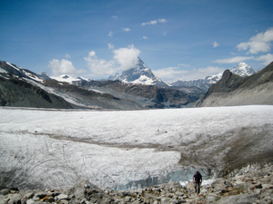 </a>
<figcaption><em>After crossing the glacier to get to the Monte Rosa hut.
</em></figcaption>
</figure>

<figure>
<a href="images/swiss-cantonal-highpoints/dufourspitze-13.jpg">
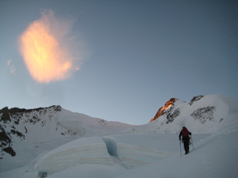 </a>
<figcaption><em>Heading up in the morning.
</em></figcaption>
</figure>

<figure>
<a href="images/swiss-cantonal-highpoints/dufourspitze-17.jpg">
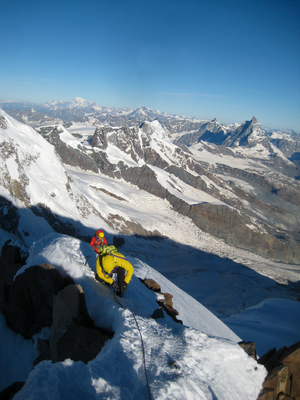 </a>
<figcaption><em>On the ridge, with the Matterhorn in the background.
</em></figcaption>
</figure>

<figure>
<a href="images/swiss-cantonal-highpoints/dufourspitze-20.jpg">
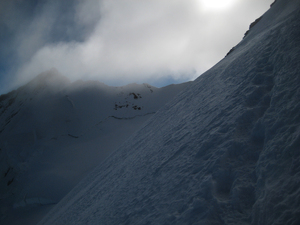 </a>
<figcaption><em>Snow on the ridge.
</em></figcaption>
</figure>

<figure>
<a href="images/swiss-cantonal-highpoints/dufourspitze-25.jpg">
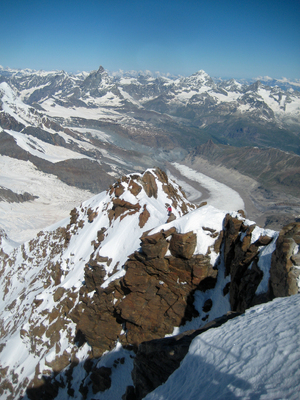 </a>
<figcaption><em>Looking back down the ridge from near the summit.
</em></figcaption>
</figure>

<figure>
<a href="images/swiss-cantonal-highpoints/dufourspitze-27.jpg">
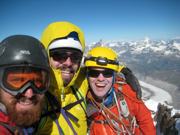 </a>
<figcaption><em>The three of us on the summit.
</em></figcaption>
</figure>

<figure>
<a href="images/swiss-cantonal-highpoints/dufourspitze-28.jpg">
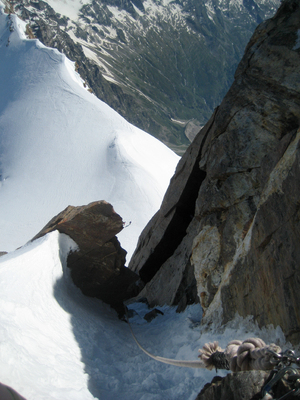 </a>
<figcaption><em>A thick fixed rope to descend back to the glacier, instead of reversing the ridge. This cost us a lot of time attempting to back up the descent with prussiks. Next time we'd take longer ropes to be able to rappel this.
</em></figcaption>
</figure>

<figure>
<a href="images/swiss-cantonal-highpoints/dufourspitze-30.jpg">
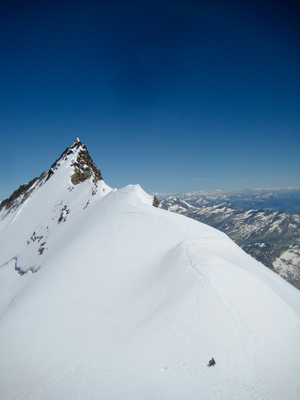 </a>
<figcaption><em>Josh was confident enough to just downclimb the (overhanging in places) fixed line without other protection, and had to wait a long time for us in the sun.
</em></figcaption>
</figure>

<figure>
<a href="images/swiss-cantonal-highpoints/dufourspitze-35.jpg">
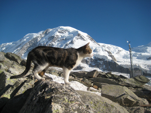 </a>
<figcaption><em>Cat back at the Monte Rosa hut
</em></figcaption>
</figure>

## 2. Schwyz - Bös Fulen

July 8, 2017

Clara, Jeff, Joel, and I climbed this peak, probably because of the fun name! We had hoped to climb Vrenelisgärtli (part of the Glärnisch massif) the next day, but were chased away by lightning!

<figure>
<a href="images/swiss-cantonal-highpoints/boes_fulen-9.jpg">
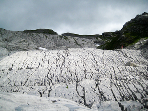 </a>
<figcaption><em>Limestone on the approach.
</em></figcaption>
</figure>

<figure>
<a href="images/swiss-cantonal-highpoints/boes_fulen-11.jpg">
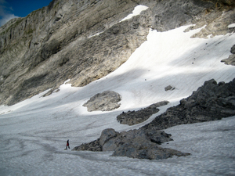 </a>
<figcaption><em>Crossing the glacier to the base of the route.
</em></figcaption>
</figure>

<figure>
<a href="images/swiss-cantonal-highpoints/boes_fulen-12.jpg">
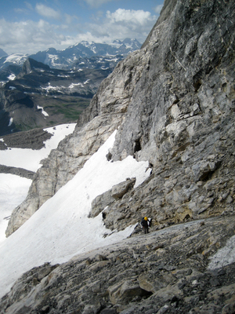 </a>
<figcaption><em>Joel at the top of the glacier, transitioning to the loose ramp.
</em></figcaption>
</figure>

<figure>
<a href="images/swiss-cantonal-highpoints/boes_fulen-15.jpg">
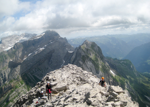 </a>
<figcaption><em>Clara and Jeff on the ridge, with Glärnisch in the background.
</em></figcaption>
</figure>

<figure>
<a href="images/swiss-cantonal-highpoints/boes_fulen-17.jpg">
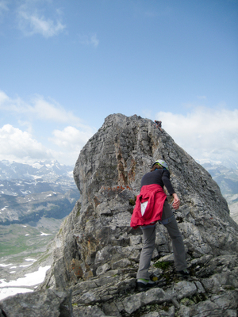 </a>
<figcaption><em>Scrambling the ridge.
</em></figcaption>
</figure>

<figure>
<a href="images/swiss-cantonal-highpoints/boes_fulen-20.jpg">
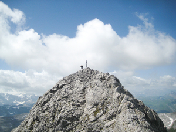 </a>
<figcaption><em>The summit.
</em></figcaption>
</figure>

<figure>
<a href="images/swiss-cantonal-highpoints/boes_fulen-22.jpg">
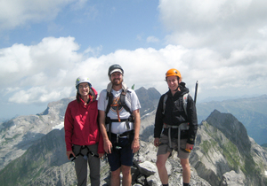 </a>
<figcaption><em>Clara, me, and Jeff on the summit (Joel taking the photo, I think!)
</em></figcaption>
</figure>

<figure>
<a href="images/swiss-cantonal-highpoints/boes_fulen-23.jpg">
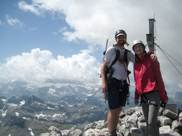 </a>
<figcaption><em>Clara and I on the summit.
</em></figcaption>
</figure>

<figure>
<a href="images/swiss-cantonal-highpoints/boes_fulen-29.jpg">
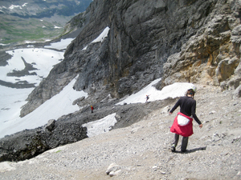 </a>
<figcaption><em>Descending the scree ramp.
</em></figcaption>
</figure>

<figure>
<a href="images/swiss-cantonal-highpoints/boes_fulen-41.jpg">
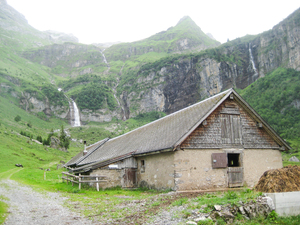 </a>
<figcaption><em>We hid in this barn after fleeing the lightning.
</em></figcaption>
</figure>

##  3. and 4. Appenzell Innerrhoden and Appenzell Ausserrhoden - Säntis

March 24, 2018 (and some earlier date)

I can't find pictures from the first time I climbed Säntis, hiking up from Schwägalp, so here is a picture from skiing down from near the summit with Yoann. I don't remember if we tagged the summit on that trip, but I certainly did on the first one.

<figure>

<figcaption><em>This was one of the most tiring days I can remember.
</em></figcaption>
</figure>

##  5. Zürich - Schnebelhorn

May 16, 2020

Climbed as part of the [Züri Oberland Höhenweg (full report)]({filename}2020_05_16_Zueri_Oberland-Hoehenweg.md).

<figure>
<a href="images/swiss-cantonal-highpoints/schnebelhorn-1.jpg">
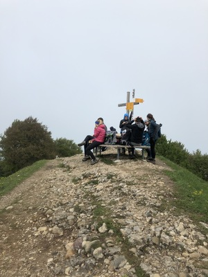 </a>
<figcaption><em>The Schnebelhorn summit, with picnic.
</em></figcaption>
</figure>

<figure>
<a href="images/swiss-cantonal-highpoints/schnebelhorn-2.jpg">
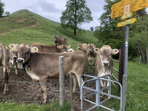 </a>
<figcaption><em>Juveniles causing trouble along the route.
</em></figcaption>
</figure>

# Attempts and Flybys

## Ticino - Adula / Rheinwaldhorn

In January 2015, Pratyush, Patrick, and I attempted this peak from Dangio, but (as I remember) we ran out of time due to the bus schedule to get back to Lugano, and turned around some way above the Adula Hut.

<figure>

<figcaption><em>View up the peak in the morning.
</em></figcaption>
</figure>

<figure>
<a href="images/swiss-cantonal-highpoints/adula-attempt-2.jpg">
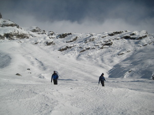 </a>
<figcaption><em>On our way back down, after climbing some way up the snow.
</em></figcaption>
</figure>

## Luzern - Brienzer Rothorn

Clara and I were close to the summit during our Hardergrat hike in July 2017,
but sadly I don't think we actually tagged it!

<figure>
<a href="images/swiss-cantonal-highpoints/hardergrat-10.jpg">
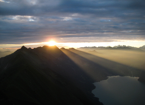 </a>
<figcaption><em>Sunrise on the Hardergrat / Brienzergrat. I think the Brienzer Rothorn is one of the bumps in the distance.
</em></figcaption>
</figure>

<figure>
<a href="images/swiss-cantonal-highpoints/hardergrat-22.jpg">
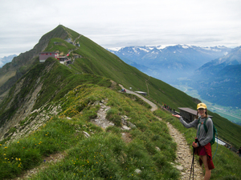 </a>
<figcaption><em>There is the summit but I don't remember us actually going up there!
</em></figcaption>
</figure>

## Zug - Wildspitz

Jordan and I climbed the peak as part of the <a href="https://schweizmobil.ch/en/hiking-in-switzerland/route-63">Schwyzer Höhenweg</a> in
fall 2022 (<a href="https://www.strava.com/activities/7863132275">Strava activity</a>), but from our GPS track, it looks like we probably didn't
tag the summit. We did the route in rainy and muddy conditions, so tagging the peak will be good additional motivation to repeat the route.

<figure>
<a href="images/swiss-cantonal-highpoints/schwyzer-hoehenweg-mud.jpg">
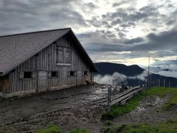 </a>
<figcaption><em>A muddy farmhouse near the end of a wet day on the Schwyzer Hoehenweg.
</em></figcaption>
</figure>
