Category: Trip Reports
Date: 2018-08-11
Title: The 7 Churfirsten

> [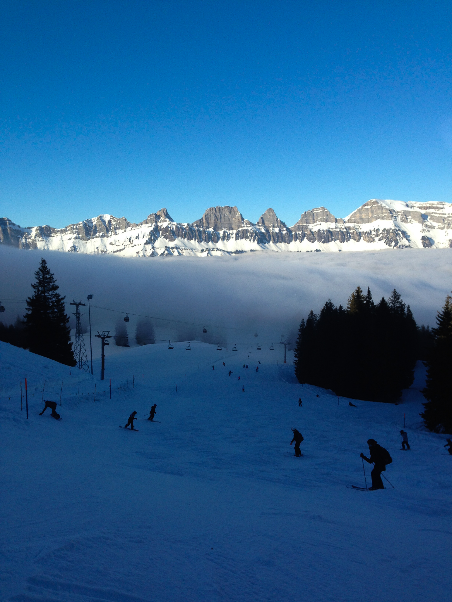{width="300px"}](images/older_posts/2018/08/flumerserberg1.jpg)
>
> The peaks from the Flumserberg ski resort. Left to right: Selun,
> Frümsel, Brisi, Zuestoll, Schibenstoll, Hinderrugg/Chäserrugg. Our
> route traverses right to left.

[The Churfirsten!](https://de.wikipedia.org/wiki/Churfirsten)

A jagged row of peaks, chopped out a huge tilted block, with a steep
drop of over a mile down to the Walensee. How could you not want to
traverse them?

The traditional traverse seems to choose, somewhat arbitrarily, 7 peaks,
with names approximately:

-   Chäserrugg
-   Hinterrugg
-   Schibenstol
-   Zuestoll
-   Brisi
-   Frümsel
-   Selun

They are everywhere you look:

> [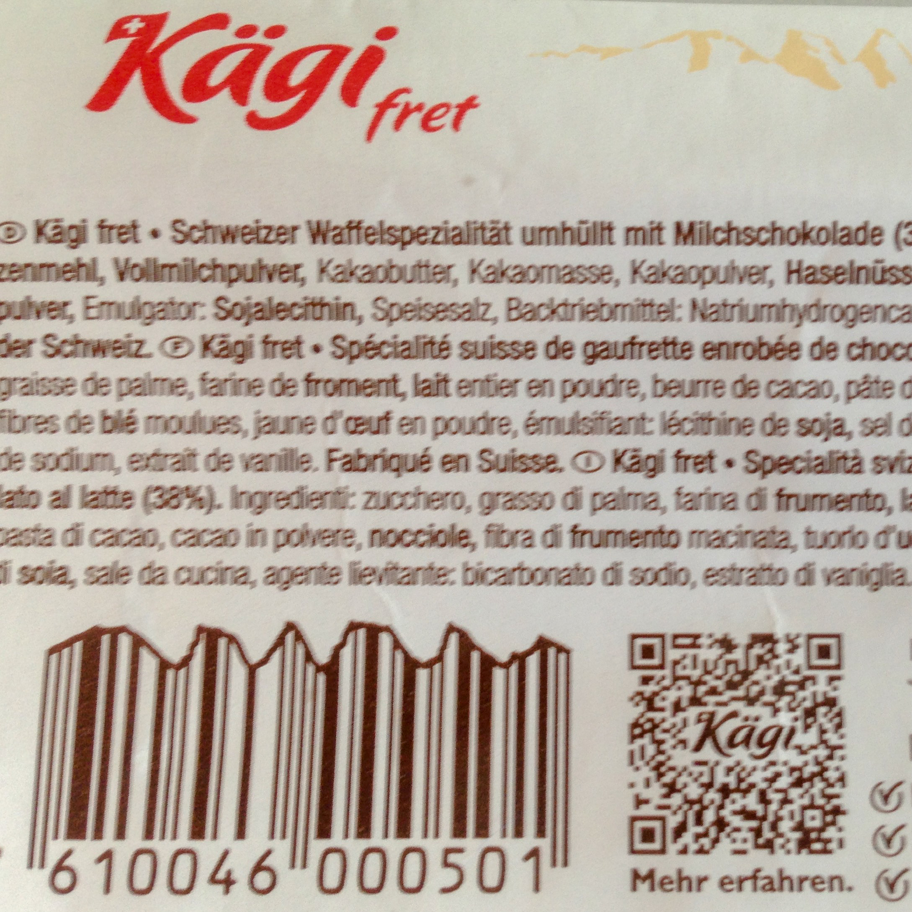{width="300px"}](images/older_posts/2018/08/kaegi1.jpg)
>
> Kägi Fret originates in the Toggenberg valley, below the Churfirsten
> (on the other side as the photo above, hence the reversed profile).

| Last summer, I made the attempt from the first train to Walenstadt and
  succeeded in finishing 5 before heat and exhaustion got the best of
  me.
| This summer, finishing all 7 was a big goal. I recruited the
  unstoppable Annelen, and soon the big day arrived, with good weather!

We camped at the Walensee and started at 4:30. After a bit of getting
lost in the town, were soon powering up the 1700m climb to the
Chäserrugg.

> [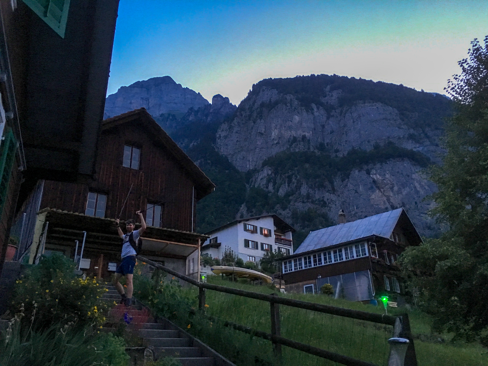{width="300px"}](images/older_posts/2018/08/wayup1.jpg)
>
> The way up through Walenstadtberg

It was soon getting light, and we were treated to a gorgeous view at the
summit.

> [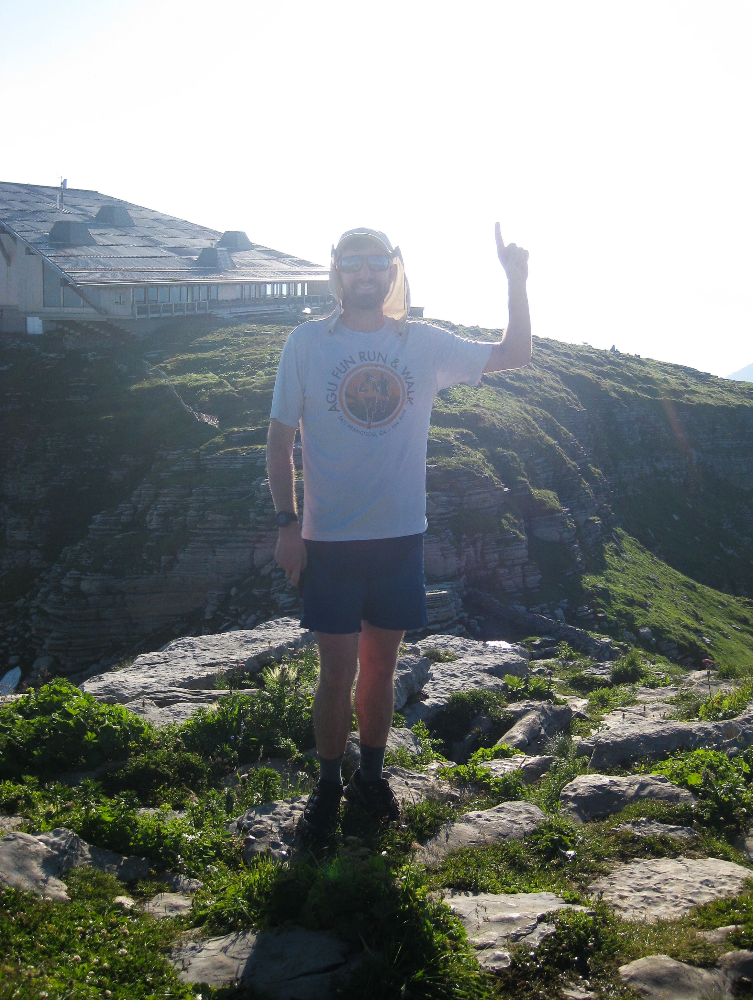{width="300px"}](images/older_posts/2018/08/11.jpg)
>
> 1! Chäserrugg

 

> [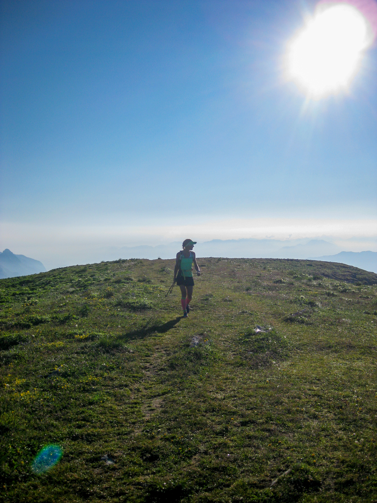{width="300px"}](images/older_posts/2018/08/hinderrugg1.jpg)
>
> Between Chäserrugg and Hinterrugg

Hinterrugg is really the same peak, so 2 down!

> [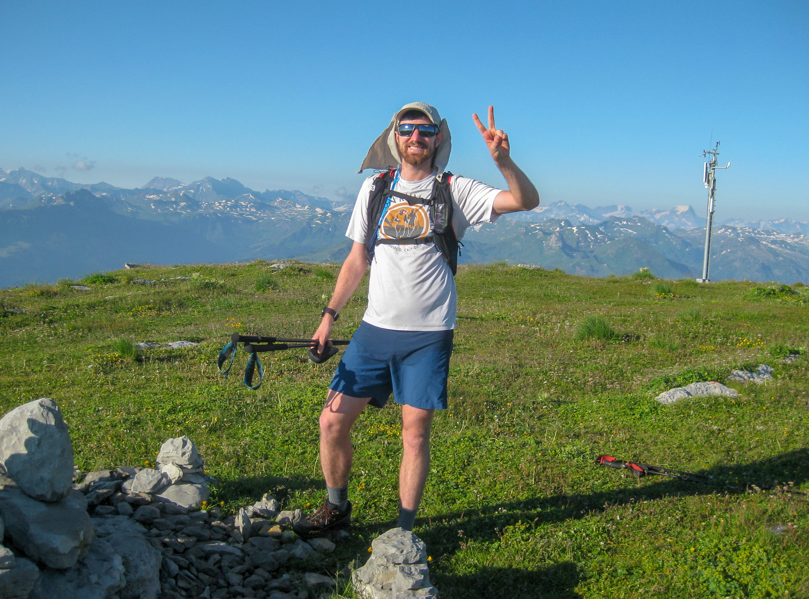{width="300px"}](images/older_posts/2018/08/21.jpg)
>
> 2! Hinterrugg

We enjoyed our first descent, down a steep rut of a trail.

Next up was Schibenstoll, with its classic view.

> [{width="300px"}](images/older_posts/2018/08/classic_annelen1.jpg)
>
> Schibenstoll
>
> [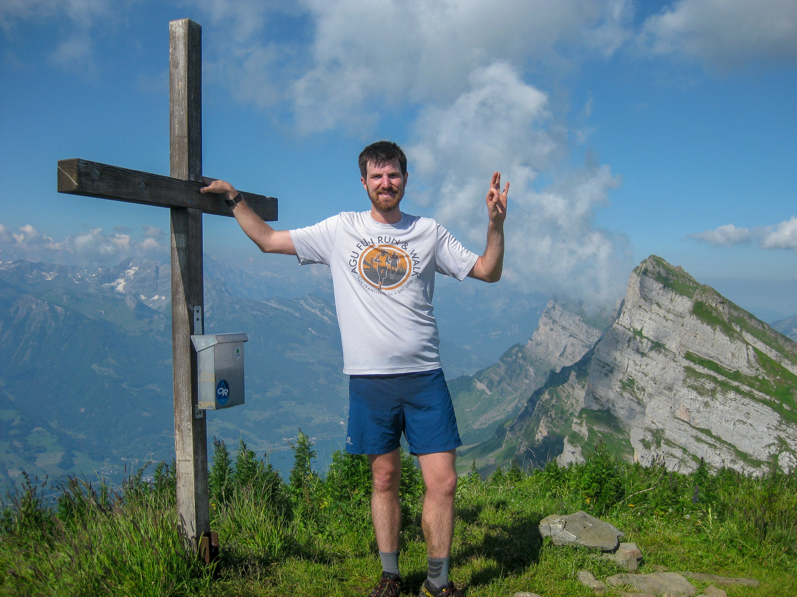{width="300px"}](images/older_posts/2018/08/31.jpg)
>
> 3! Schibenstoll

Thankfully we encountered a dripping faucet just below the
Schibenstoll/Zuestoll junction (as I had last time), or I would have
been done for.

Then, my third time hiking Zuestoll. This time, though, we hiked up the
other side, which was actually easier and featured a cool section hiking
underneath an overhang.

> [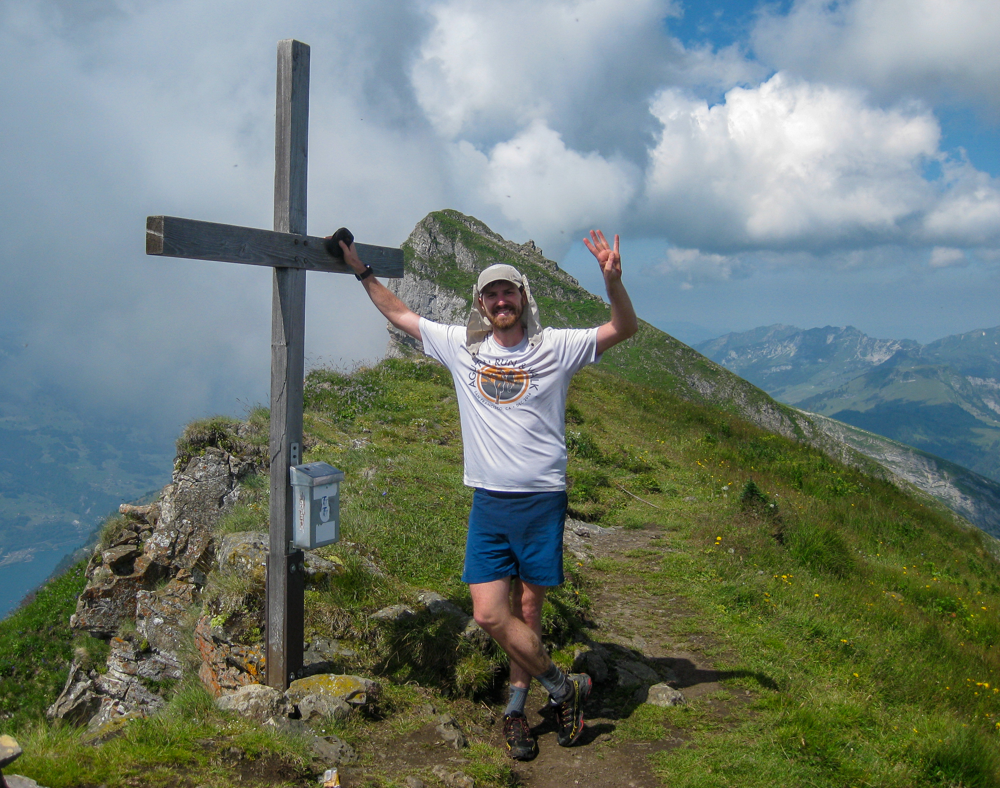{width="300px"}](images/older_posts/2018/08/41.jpg)
>
> 4! Zuestoll

At this point I was not doing very well - quite tired and dehydrated,
and thus unable to eat enough. I was suffering at the top of Brisi.

> [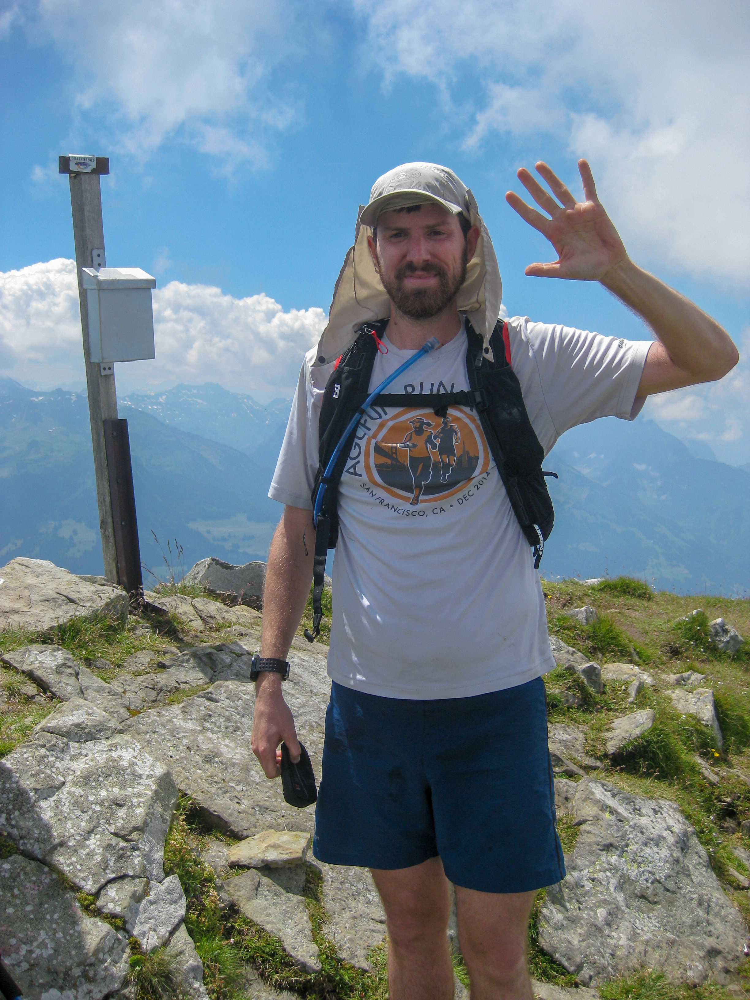{width="300px"}](images/older_posts/2018/08/51.jpg)
>
> 5! Brisi

Fortunately, we were saved by a cow barn! Thanks for sharing your water,
cows.

> [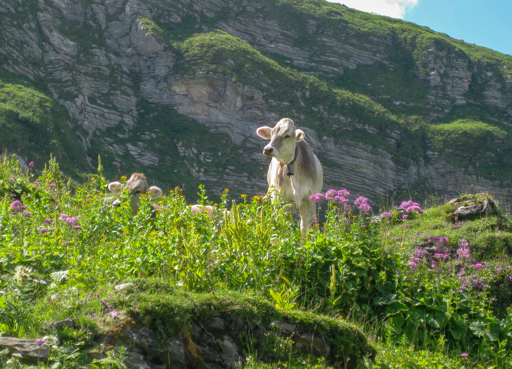{width="300px"}](images/older_posts/2018/08/prettycow1.jpg)
>
> Switzerland: cutest cows in the game

Even more steep grassy trails let us to Frümsel.

> [{width="300px"}](images/older_posts/2018/08/steep1.jpg)
>
> Steep trail on Frümsel

 

> [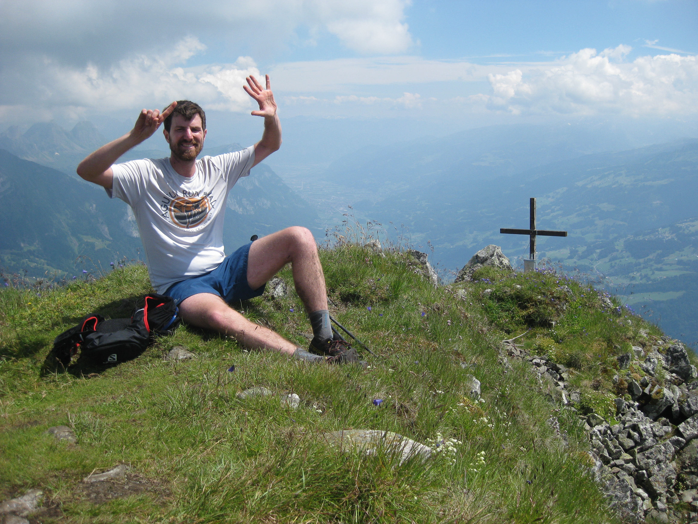{width="300px"}](images/older_posts/2018/08/61.jpg)
>
> 6! Frümsel

There are several enormous holes in the ground around here - one even
had anchors for some brave soul to rappel into. Be careful!

> [{width="300px"}](images/older_posts/2018/08/trail1.jpg)
>
> Typical trail

 

> [{width="300px"}](images/older_posts/2018/08/coming_down1.jpg)
>
> Descending from Frümsel

 

> [{width="300px"}](images/older_posts/2018/08/lastone1.jpg)
>
> The last one!

The technical crux was this "third class grass", marked by yellow dots
offering a shortcut to Selun.

> [{width="300px"}](images/older_posts/2018/08/third_class_grass1.jpg)
>
> The technical crux

Finally we reached the summit of Selun! The view, now the 13th time, was
about the same.

> [{width="300px"}](images/older_posts/2018/08/71.jpg)
>
> 7! Selun

 

> [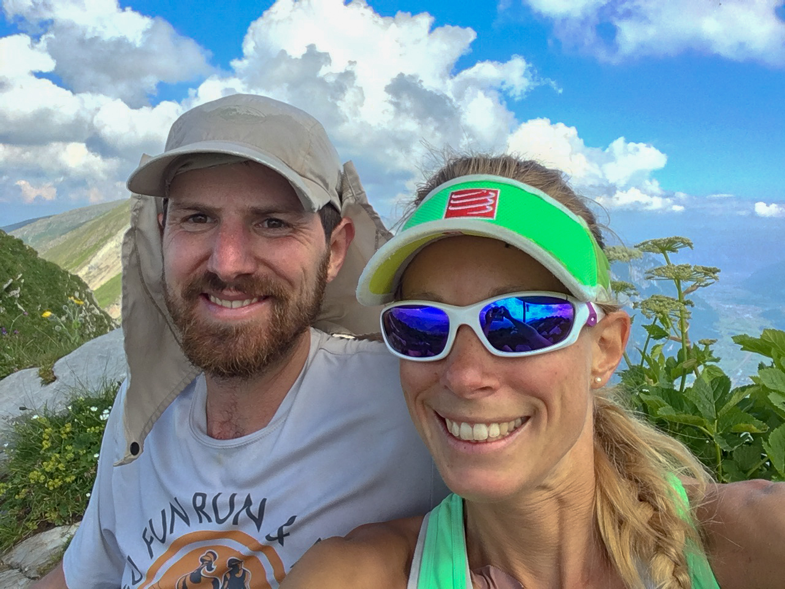{width="300px"}](images/older_posts/2018/08/selfie1.jpg)
>
> Made it!

We descended on the proper trail, even running parts and arriving
exhausted (for me, anyway) in the hot valley. Annelen sprinted for the
bus and got yelled at holding it up for me.

> [{width="300px"}](images/older_posts/2018/08/run1.jpg)
>
> The way down was the only consistently-runnable part

I highly recommend any or all of these peaks! Having now collected 13
summits from amongst these 7, I'll probably take a break for a while.

> [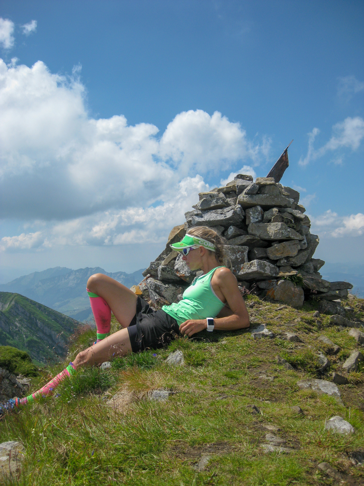{width="300px"}](images/older_posts/2018/08/bored1.jpg)
>
> Annelen, not impressed by the view anymore

 

> [{width="300px"}](images/older_posts/2018/08/tired1.jpg)
>
> Yawwnn

# Stats

I think that this certainly qualifies as the steepest day I've ever
  done, with the highest average grade and the most elevation gain.

* date: July 9, 2018
* time: ~14 hours
* horizontal distance: ~40km
* vertical distance ascended: ~4500m
* vertical distance descended: ~4000m
* average grade: >20%
* terrifying pits fallen into: 0
* Water I drank: ~7 L
* Water Annelen drank: ~2.5 L
