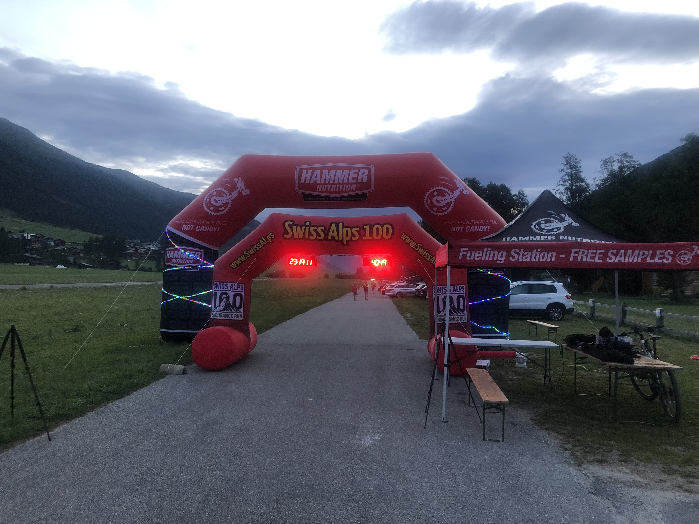
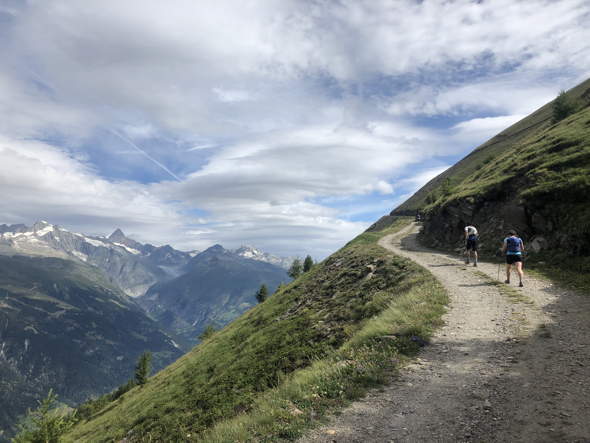
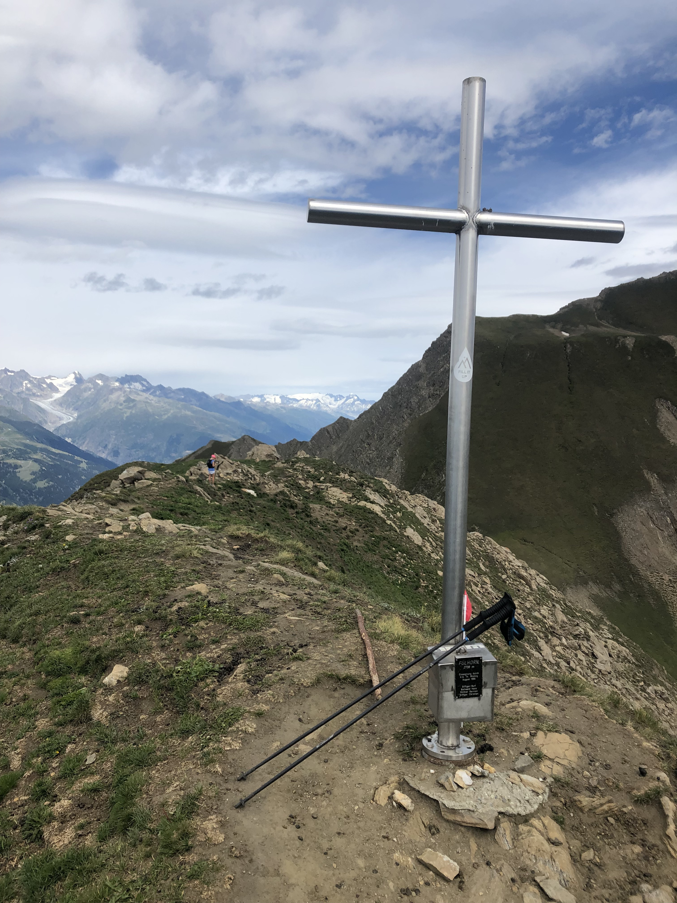
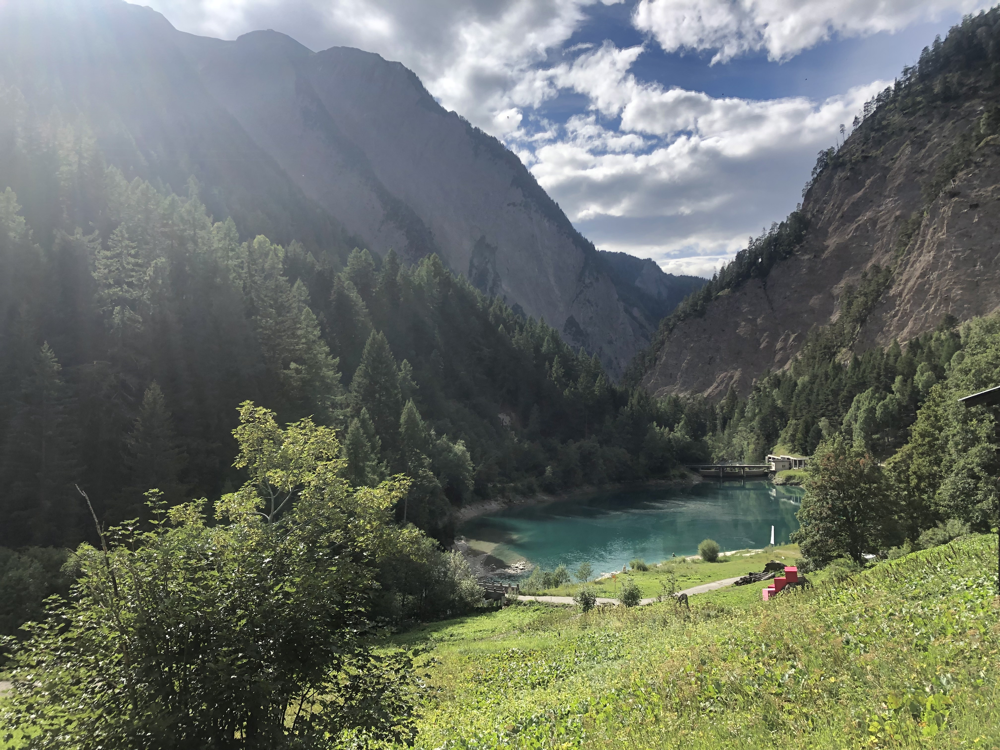
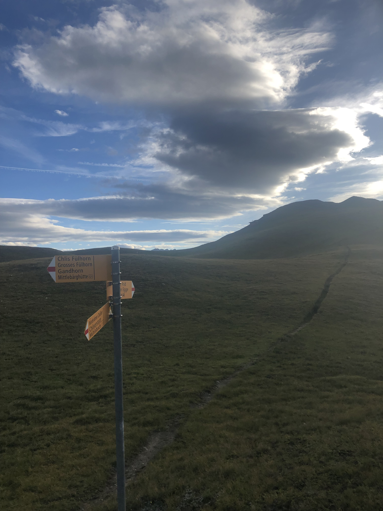
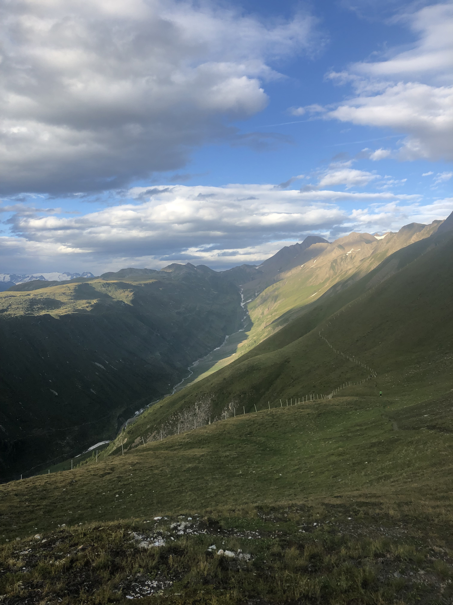
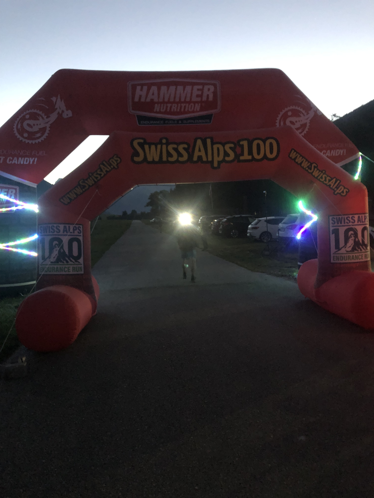
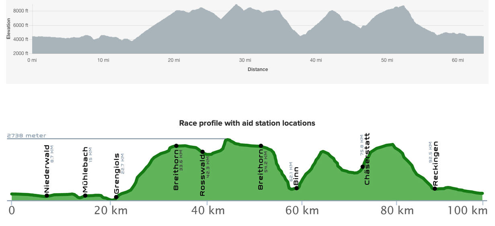
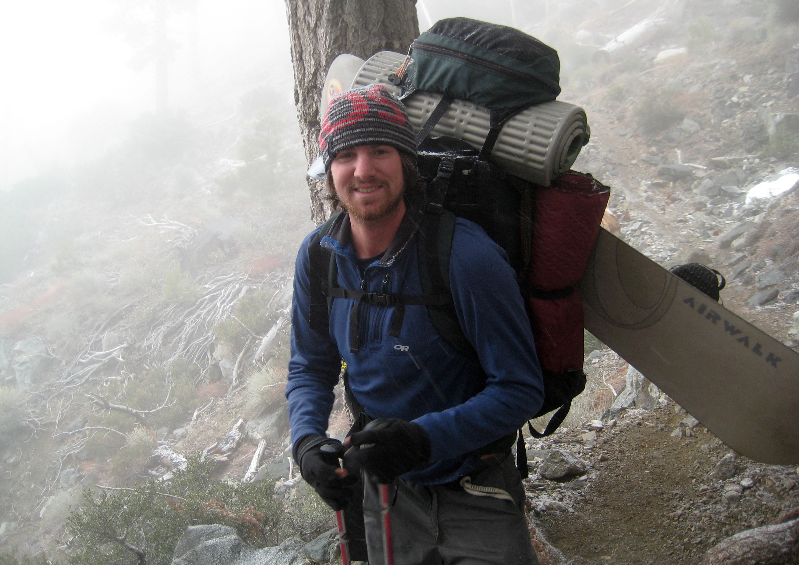

===============
Swiss Alps 100k
===============

:date: 2019-08-17
:category: Trip Reports

My second official ultra, and a different experience from `the first <{filename}swiss-canyon-trail-105k-2019.rst>`__.

This was the `Swiss Alps 100k <https://swissalp.ps>`_ - the route is just over 100km, with about
5400m of elevation gain, starting in the Valais at ~1300m and reaching a high point
of ~2700m.

I underestimated this race, in several ways, and it taught me some things.
Thus, this post will include a short recap and move on to (potential) lessons learned.

.. figure:: images/2019_08_17_Swiss_Alps_100k/fuelhorn_pano.JPG
  :target: images/2019_08_17_Swiss_Alps_100k/fuelhorn_pano.JPG
  :width: 100%
  :alt: Panorama from the Fülhorn

  *View from the Fülhorn, the high point of the Swiss Alps 100k, with Brig visible in the valley below*

Race Recap
==========

The race began at 7 am on Saturday morning. Mike and I had arrived the evening
before and registered, camping with Angie and Ryan at a nearby campsite.
Cleverly, we moved our tents once we saw the telltale signs of partying Swiss
bros nearby.

  *The timer for the ongoing 100-mile race, and the countdown for our 100k race*

Mike and I trotted along in the middle of the pack for the first "flat" 20km, which still featured
a couple of steep ups and downs, and an exciting crossing of a long bridge

.. figure:: images/2019_08_17_Swiss_Alps_100k/bridge.JPG
  :target: images/2019_08_17_Swiss_Alps_100k/bridge.JPG
  :height: 300px
  :alt: bridge

  *Bridge, early in the route*

Some more traversing next to a man-made stream to transport water across the hill,
and we were at the foot of "The Beast". This was an evenly-graded, switchbacking
fire road that climbed 1200m.

  *"The Beast", with views of the Aletsch glacier*

After an aid station at the top, the Breithorn, some ups and more down led to the Rosswald aid station,
shortly before the start of the very steep climb to the Fülhorn (beware the false summit of the
Fullohorn, replete with decoy summit cross!).

This was the high point of the route, with great views in the perfect weather.

  *The Fülhorn summit*

The route had been marked well so far, with flags and spray-painted
arrows. This part of the trail was the only part that one was supposed to covered twice - after
rejoining the route, one was to turn left and head back to the top of The Beast.
However, this turn was not marked well, and the cartoon of the route
on our race bibs implied downhill all the way back to the Breithorn.
Thus, I and 4 other people happily descended the
whole way back to the Rosswald aid station, thinking that we hadn't yet
rejoined the main trail. We then had to backtrack about 2.5 km and 300m of climbing.
Lame.

After a short climb from the Breithorn aid station,
there was a long, steep descent to Binn.

.. figure:: images/2019_08_17_Swiss_Alps_100k/before_binn.JPG
  :target: images/2019_08_17_Swiss_Alps_100k/before_binn.JPG
  :height: 300px
  :alt: before Binn

  *Before the descent to Binn*

The aid station there was inside
a building, and I spent(/wasted) 30 minutes there changing my socks and underwear
from my drop bag, eating, and using the bathroom.

  *The valley near Binn*

I was very tired already as I headed up the next climb. I was dismayed to find
that, not for the first time that day, I had filled my water bladder with
bubble-gum flavored isotonic liquid, not water. This didn't seem to be as
thirst-quenching and seemed to upset my stomache. Luckily, I came across a fountain on the climb.

.. figure:: images/2019_08_17_Swiss_Alps_100k/fountain.JPG
  :target: images/2019_08_17_Swiss_Alps_100k/fountain.JPG
  :height: 300px
  :alt: fountain

  *A very welcome fountain*

I was very happy to reach the top of this climb because, though exhausted, I
now knew that only one big uphill section remained.

  *After the third and penultimate big climb*

  *The Rappertal*

I was crawling on the short, steep
uphill up to  the Chäserstatt aid station.  I sat for a long time, trying to
eat and drink (not much good food there - I ate cookies). The volunteers were
very helpful, and let me use a space blanket to warm up when I started shivering.
Thankfully, they also let me know ahead of time about the rolling terrain I'd encounter
on the next climb.

It was now totally dark. I hiked up the steep fire road that was the start of the next climb.
I turned on my headphones at this point. The music, as usual, strongly affected me.
Frida Hyvönen's "Dirty Dancing", in particular.
It was beautiful to see the lights of the Valais, and later the almost-full moon.

Rolling terrain with an intermittent trail was slow going. We followed reflectors
on flags and red-and-white trail markers. Once, there were dozens of reflectors,
but all but one were cows' eyes. Near the end of the climb, I joined up with
another runner struggling to stay on route, and we mostly stayed together to the
top of the climb and down the tricky part on the other side.

The last descent was tricky to stay on trail.  Luckily for me, my temporary
partner had a working map on his phone, which saved us some time during one
particularly non-obvious section which involved traversing about 100m of snow.
Then, down down down to the Reckingen aid station. This had been moved from an
earlier point, shortly before the race, so this section was a long 16km,
including 900m of climbing. I had eaten my last gel on the climb and moved
quite slowly down what by rights should have been a fast gradual downhill
section down a good trail.

After the aid station, some horrible rolling, traversing trails, then a return
along a gravel road the airport. Angie and Clara were there to meet me at 2:40
am, after having stood around for a very long time, due my very optimistic
low-end estimate of the time I'd need.

With the wrong turn and backtracking, I took 19:39:59 and covered about 108 km with 5800m of climbing; the most elevation I've ever gained in a day.

A couple of hours later, Mike rolled in to complete his first ultra, which
wasn't an easy one, even for a 100k! Huge respect.

  *Mike finishing.*

Lessons Learned
===============

1a. Do your homework to know the route
--------------------------------------

On the `Swiss Canyon Trail <{filename}swiss-canyon-trail-105k-2019.rst>`_, and even more so on the Jungrau Marathon, the
route was very clearly marked (almost) everywhere, and there was essentially no
route-finding required.  Those are the only two long, organized races I've
done, and they instilled a false sense of security.
Here, while the route was well marked most of the
time, I lost time and motivation in a few places due to my
ignorance of the route.

A side note is to not trust the "cartoon" version of the elevation profile.
For this race, the cartoon was printed on our race bibs, upside down - handy but misleading!

  *Real and cartoon profiles, from the race website*

While this does let you know where the aid stations are, there were two times
when I felt particularly betrayed.  There is the strong implication that one
purely descends from the Fülhorn (the high point) back to the Breithorn.  This
isn't really true - once you rejoin the trail you came in on, you actually
ascend a little bit.

The last part of the race was also quite frustrating, as the cartoon shows a
steady descent after a small climb, when in fact one undulates above and below
a contour on a hiking path, with a couple of very steep drops back to the road
for the last part of the route.

Of course there's really no excuse, given the myriad options to study and carry
a precise map. One can even download the course and take a look in 3D!

1b. The details of the elevation profile matter
-----------------------------------------------

It seems intuitive to me that one should first worry about the low-frequency
details of such a long course - where are the big ups and downs? This was all I
worried about, beforehand, which was a mistake. There are is more to a course
than just the average angle over a kilometer. When you have 1000m climbs, it's
easy to overlook climbs of 100-200m as insignificant, though they certainly
aren't, at least mentally, as one tries to avoid falsely anticipating "easy"
sections.  The rolling section near the end of this race was difficult when
tired, as one had to constantly "change gears".

2a. Other runners: trust, but confirm
-------------------------------------

I wasn't very worried about being off course, when I got off course, because in
addition to my trusty cartoon, I was following other runners making the
same mistake. On the other hand, having other runners around was very helpful,
particularly at night, both for route-finding and for moral support.

2b. Make friends
----------------

I stayed pretty focused on my own race, but I noticed many around me
socializing during the run, and I think it helped them have more fun and
maybe even go faster, particularly in those times when we were getting lost
or when morale otherwise flagged.

3a. Weight matters
------------------

My early exploits in the mountains were gung-ho
backpacking/mountaineering trips where it was a point of pride to
take a lot of junk with you. For instance, here's me hauling an
80-pound pack, including a snowboard I could barely ride, up Mt.
Baldy.

  *Why not?*

I always felt like people counting grams were engaging in premature
optimization (the root of all evil, of course). I still believe that for
training or any endeavor away from the the edge of one's ability. However, if
you're trying to finish a race as fast as you can, you're by definition
at the edge of your ability. Thus, I'll make more of an effort to go light
next time.

For this race, I wasn't really sure what to bring to fulfill the requirements
that one carry some sort of long pants/leggings and a warm upper layer. I
brought some light hiking pants and light down jacket. Those probably added
a kg or two, which seems like nothing, but I certainly noticed that my
pack was heavier than normal, and carrying extra weight up 5000m doesn't seem
advisable.

3b. Drop bags seem useful, but could be a time sink
---------------------------------------------------

This was the first time I used a drop bag. It was luxurious to have fresh
underwear and socks. (A fresh shirt would have been nice, too).  However, I
managed to spend 30 minutes at the aid station with the drop bag, which is far
too much, even though I felt I needed a longer break than usual. Next time I'd
bring extra socks (and even shoes) as insurance against wet feet or blisters,
but hope not to use them.

I realize that I could have used the drop bags to address the weight problem
above, putting heavier, warmer things into the drop bags and only running with
the lightest "legal" versions of the required gear.

I could also have used the drop bags to provide additional nutrition
options. It's great to have at least something you find somewhat-appealing
to eat, and several times during this run I found that nothing fit that bill
except for gels, shot blocks, coke, and perhaps m&m's. It would be smart to
leave extra gels and shot blocks in my drop bag(s), as these weren't
consistently available at the aid stations. (At the last station I did get a
couple of chocolate Hammer Gels, though - fantastic).

Similarly, on runs which didn't require one to carry extra batteries or an
extra headlamp, these would be useful to have in a drop bag.

Thus, a working approach, going forward, is that the drop bag should be there
to provide options to help you go lighter and recover from setbacks, not as an
oasis of time-wasting comfort.  That thinking perhaps extends to the aid stations
themselves. On one occasion on this run, at Chäserstatt, I didn't feel like I
had any choice but to stop at the aid station and refuel while sitting, but
otherwise I think it's best to get what you need and get moving.

4. Psyche returns
-----------------

Unlike previous routes, I didn't immediately feel good about this one.  I was
happy to finish (under the cutoff time to enter the lottery for the Western
States 100), but felt I could have done it faster (which obviously I could
have, if I'd stayed on route) and had found the last ~10 km of the course very
frustrating, when usually I'd just be excited to be on the home stretch.  The
post-mortem email from the race organizers, surprisingly, mentioned that so
many people had also hated the rolling section near the end that they are
actually considering modifying the course! Despite all this, though, a couple
of weeks later I am only happy about it and am already dreaming of the next
objective.
