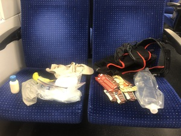

======================
Züri Oberland-Höhenweg
======================
:date: 2020-05-16
:category: Trip Reports

I was poking around the `Fastest Known Time website <https://fastestknowntime.com/>`__ and noticed that there
were a few routes nearby, including for the `Züri Oberland-Höhenweg <https://fastestknowntime.com/route/zuri-oberland-hohenweg-switzerland>`__, a `regional route <https://www.schweizmobil.ch/de/wanderland/routen/regionale-routen/route-069.html>`__.
This looked like a reasonable objective during the pandemic, as it only involved a couple of short S-Bahn rides.
I planned to do the route unsupported,
carrying all my food, supplies, and garbage, with the exception of drinking from (plentiful, yay Switzerland!) public fountains.
The route can be done as a 4-day hike, and some of the huts, restaurants, and hotels along the way actually did appear to be open, though I only directly observed one group of customers.
I was optimistically hoping to finish under 9 hours, though 10 was my realistic estimate.

  *Usual gear, plus a facemask*

The forecast looked great: cool in the morning and about 20 in the afternoon, with no chance of rain.
I took the first train to Winterthur, arriving just after 6, took my starting photos and started my watch, and began following the "69" signs describing the route.

  *The start, at the Winterthur main station*

The route was well-marked almost the whole way, though I did make a couple of errors and have to make short backtracks.

The trail made its way out of town in the cool morning and began following a fire road. I soon came to a barricade across the road announcing that the `Wildpark Bruderhaus <https://stadt.winterthur.ch/themen/leben-in-winterthur/freizeit-und-sport/ausflugsziele-freiraeume/wildpark-bruderhaus>`__ was closed, so I took a detour around the park, down a hill and back up, to rejoin the trail.

Conditions stayed cool as I was treated to gorgeous light filtering through clouds.

  *Cool temperatures and beautiful light in the morning.*

The trail for the first part was varied - many roads and fire roads, but also some car-washing single track sections across grass, and some step and root-laden forest trails. I saw very few other people for the first half of the route.

The second half gains higher elevations and begins to follow steep ridgelines more closely.

I saw a few hikers in very small groups, but nowhere near the number one would normally expect on such a beautiful day, in such a beautiful location.
Temperatures stayed cool and conditions partly cloudy as I slowly ascended, with many ups and downs.

  *Farmland along the way*

  *About to get carwashed*

  *I haven't yet been able to Google the etymology of this. If I had to guess I'd think it's from a local dialect and has nothing to do with German or English "Hand", especially because there is a mountain called "Höchhand" nearby, but I have no real idea!*

  *Endless ridgelines*

  *Just like human adolescents, I gave these guys a wide berth*

  *Lots of up and down on ridgeline trails*

I took another small detour, up and over a bump on the ridge, instead of around it, as the trail was completely covered with felled trees.

Almost all of the elevation I'd slowly gained so far was lost in a single steep downhill section, which deposited me close to lake level, but still quite a long way from Rapperswil.
While not unbearable, the temperature increased for the last segment, which took me quite a long time.
The trail heads straight through the town and ends with a contrived loop past the castle, along the dock, and back across the street to the train station.
I stopped my watch, having cleared the 10 hour mark by 59 seconds!

  *Near the bottom of the rapid descent back to lake level*

  *The end of the route, at the Rapperswil main station*

.. figure:: images/2020_05_16_Zueri_Oberland-Hoehenweg/small/IMG_5563.JPG
  :target: images/2020_05_16_Zueri_Oberland-Hoehenweg/IMG_5563.JPG
  :width: 300px
  :alt: ten hours

  *Barely under ten hours*

  *My sweet reward*

`Activity on Strava <https://www.strava.com/activities/3460788810>`__

`GPX file <{static}/data/Move_2020_05_16_06_12_16_Running.gpx>`__
