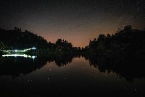

===
VDA
===
:date: 2021-07-09
:category: Trip Reports

The 2021 VDA, my first 100-mile race!

The `Ultra-trail du Mont Blanc (UTMB) <https://en.wikipedia.org/wiki/Ultra-Trail_du_Mont-Blanc>`__ is a foot race,
run since 2003, that follows the classic `Tour du Mont Blanc <https://en.wikipedia.org/wiki/Tour_du_Mont_Blanc>`__
trekking route, and which has grown (in ways both good and bad) to become essentially
"the" trail ultramarathon in Europe (as `Western States <https://www.wser.org/>`__ or perhaps `Hardrock <https://hardrock100.com/>`__ are in the U.S.). I heard about the race from my aunt, years ago, before I ran much, and I even have a 2006 UTMB shirt that she gave me. Until somewhat recently it didn't seem like something I could do, but I think that now it's in reach.

The policy used to be that if one had two sufficiently-long, sufficiently-recent qualifying races and entered a lottery each year, entry was guaranteed by the third attempt.
I'd already entered once, so the plan was to repeat
that twice. COVID-19 delayed this plan, along with many things less trivial,
but more crucially the rules changed for 2020: to qualify automatically
one needed to earn enough "running stones", tokens earned
by running (now-defunct) Ultra-Trail World Tour races or "by UTMB" races around the world.
Annoyingly IronMan-y, yes.

Fortunately, there was a new "by UTMB" race in Europe, the `"Val D'Aran by UTMB" <https://www.aranbyutmb.com/en/>`__,
and I was excited to run it - the `longest route, the Torn dera Val D'Aran (VDA) <https://www.aranbyutmb.com/en/vda-en/>`__ was of a comparable profile
to the UTMB itself, about 100 miles with 10000m of climbing, topping out at over 2500m. It was in the Pyrenees,
which I'd always wanted to visit, and handily enough, a finish earned one precisely the 18 mystical
stones needed for UTMB. Great! (Note:
the rules have changed *again*, and the stones now get you additional lottery
draws, not direct access. The 2021 VDA was `granted an exception <https://utmbmontblanc.com/en/page/745/exceptionVDA.html>`__.)

 |route|

 The 100-mile VDA route, with Vielha (start/finish) and 3 large "life base" aid stations marked.

|

 |profile_2x|

 The VDA course profile.

Preparation
-----------

Our little son was born at the end of 2020, so finishing the race without injury was my only real running objective for 2021.

Thanks to the support of my partner, I was able plan a reasonable amount of training,
and started ramping up the mileage in the early spring, hoping to get a least a few of those
100 kilometer weeks  (if not 100 mile weeks) that most training plans recommend. This wasn't to be.
At the end of my first 80k week, the morning after a 30k with a lot of hills, my right foot felt really, really bad. Walking was painful, and running,
especially uphill, was out of the question. I stopped running completely after a couple of failed jogs. After about a month with only minor improvement, I got an X-ray to rule out
a stress fracture. Nothing showed up and the doctor's guesses were as good
as my mine and my mom's (She's a doctor, but of course couldn't actually examine me from afar). Posterior tibial tendonitis seems probable,
and I suspect there is also some damage to the fascia or other soft tissue around the heel.

In retrospect, the obvious error was using old shoes,
with well over 1000 km on them (I know, I know..), that didn't support my arch.
I also wasn't modulating my training enough - I had steadily (though slowly) increased
my mileage by a few km/week, from nothing after the baby was born up to 80 km/week, over about 3 months.

Very thankfully, my foot did slowly improve. I wore shoes all the time and tried to do a lot of stretching and yoga. As long as I was wearing my
good shoes (for running, my new Hoka Speedgoat 4s) the pain
didn't correlate with much except how much I stretched. Crucially,
how much I walked or ran didn't make a huge difference, even the next day.

Encouraged by this, I cautiously started
running again, with the race about 3 months away. There was pain, which was indeed more on bigger weeks early on,
but I still saw steady, slow improvement and started adding in more climbing. I soon realized that even trying as hard as could on my local trails, I couldn't quite simulate the steepness of the VDA course, which *averages* 13% grade over 100 miles - yikes!

I only managed to get back up to about 80km a week at my peak, but during our visit
to family in France I did get the chance to at least do some steep, technical trails,
on two iconic mountains in Provence: St. Victoire and Mont Ventoux.

  |st_victoire|

  Training on St. Victoire, with my sister on her biggest trail route yet! (Click photos for full-size versions)

|

  |ventoux|

  Mont Ventoux is famous for being a massive climb during many Tour de France stages. It also hosts a trail marathon. I (somewhat-intentionally..) came up the ridge in the background here (slow, but good training!) and descended the race route.

Those outings went fine - I felt tired (and hot) at the end of each,
but not obliterated.

Going into the race, my lack of training worried me. I had
taken 5-6 weeks completely off, 3 months out. Since the `Obwaldner Höhenweg Loop <{filename}2020_09_12_Obwaldner_Hoehenweg_Loop.rst>`__
in September, the most distance I'd done in a week was about 80km, the most climbing
about 3500 m, and I hadn't done any single push longer than a marathon. In previous years, the months before successful long routes had included shorter long routes.

The section I was thinking of as the "hell bowl", the long segment starting at about 120km, before the Colomers aid station, was where I pictured things getting miserable enough to cause me to drop out. It was late in the race (but not late enough to be "almost there"), it was the highest altitude on the course, reaching about 2600m, it was very rocky terrain, and it would come during the second night.

Still, somehow, I thought I could do it. I have gone for 100 miles in a 28.5-hour push (starting at midnight) once before, during my `self-supported 100-miler <{filename}2019_09_13_100m.rst>`__.
I think this did wonders as far as mental preparation, which is maybe the most
important thing if one is simply trying to finish. I knew I could
go for that long and face that level of sleep deprivation (though I was planning
on about an hour of sleep, unless things were going extremely well).

I was feeling well-rested, and I assumed that the course would be very well marked
and the aid stations well-stocked (which was 100% true), which would allow
me to focus on the essentials.

I made a spreadsheet with my predicted splits for a 40 hour finish. My optimistic goal was 36, but 40 seemed like a good guess, as this is a middle-of-the-pack time for the UTMB.

I made the effort to boil down
my advice to myself into easy-to-remember form:

1. Efficiency
2. Eat a lot
3. Reset

"Efficiency" means to let my mind rest on the idea
of getting to the end with the minimal resource usage. Run efficiently
and with consistent effort, pick good lines, and above all try not to waste time
doing things like stopping, sitting, messing with my pack, and relaxing too much at aid stations. For slow people like
me (especially when undertrained like this), this is really the best way to go faster:
just try to never stop. Long ago I once asked someone who had hiked with `Bob Burd <https://www.snwburd.com/bob/>`__ how he was so fast - the
answer I got was "he never stops". This was also a key takeaway from my reading of Brett Maune's report on his JMT record. The average speed required to hit your target time is typically low - the trick is to mimimize the time you spend going at 0 km/hr.

"Eat a lot" means to take advantage of the revelation from the `Swiss Canyon 100k <{filename}swiss-canyon-trail-105k-2019.rst>`__
where I felt like complete garbage, finding it painful to walk, then ate some pasta, and was then running again,
happily. Thus, I intended to eat "real food" every single time I could find it at an aid station,
especially including the hot foot provided at the three big "life base" aid stations.
This was in addition to my usual practice of making sure to eat and drink at least once an hour. I think I'm above average in terms
of being able to shovel food into my face, which is a talent I should take
full advantage of.

"Reset" is the tough one. It means to recall your experience and recognize that there will be temporary lows, and to actively seek opportunities
to emerge from them. In minor cases, this means simply always looking ahead,
leaving each aid station, each climb, etc. thinking like it's the start of a
new race. It means deliberately taking stock of the situation and coming up with a positive (or at least dispassionate) way to tell the current story. In more extreme cases, it means recognizing when you need a harder reset -
a break at an aid station, a change of clothes, extra food, or a nap. These
things cost time, so there's a tension with point #1.

Pre-Race
--------

The race fell within my mom's visit to Europe, so we made plans for the whole
family to travel to the Val D'Aran for the race: me, my mom, my wife, my son, my sister, my brother-in-law, and my nephew.

The `Val D'Aran <https://en.wikipedia.org/wiki/Val_d%27Aran>`__ is part of Catalonia (Spain)
and sits on the northern side of the Pyrenees, accessible easily from France.
It has a couple of large ski resorts and clusters of ski chalets. The people
are very friendly and it seems acceptable to start conversations in either
Spanish or French, though the local language, `Aranese <https://en.wikipedia.org/wiki/Aranese_dialect>`__, is still in use and taught in schools - our AirBnB host sent us screenshots of weather updates in Aranese. The place was very Spanish in its
heavy emphasis on ham (the grocery store featured a row of no less than 4 people simultaneously
carving legs of ham on special ham leg stands).

We drove from Provence the day before the race. I had spent a lot of time and
money trying to get a relatively light version of the required gear for the
race, in particular some stupidly light-weight waterproof pants, and finding
the lightest 3/4-length tights at Decathlon. Thus, I was somehow disappointed
when they checked nothing at the bib collection.  Oh well.  The gear was
all useful, and I was happy to have a lighter pack than I would have had otherwise.

The race, like the UTMB, starts at 6 pm on a Friday. This seems a bit sadistic,
from a sleep deprivation standpoint.
However, it maximizes time at night,
with cooler temperatures. Also, it's the only way to squeeze a race this long into
a weekend.

I spent the morning picking up my bib, running around Vielha with my mom, who eventually
found us some safety pins, and being grumpy from nerves and my lack of morning coffee.
My family provided me with some excellent meals leading up to the race,
and very fortunately I managed to eat a nice big lunch and then sleep for about 2.5 hours.

We made our way down the town, parked quite a way outside, and wandered to the town center.
We hung out at an outside bar for a bit, and I made my way to the start at about 5:30pm.
I picked a shady spot in one of the starting corrals and sat down to wait. European runners
all look very intimidating, with their colorful gear and grooming.

 |start|

 The start of the 2021 VDA

|

 |start2|

 The season it's all about colorful shoes and smooth calves.

The Race
--------

Friday
~~~~~~

After some enthusiastic yelling over the PA from the announcer and some rousing `Vangelis <https://en.wikipedia.org/wiki/Conquest_of_Paradise_(song)>`__, it was time to go!

As always, I thought I was going out easy but I was not.

I was probably somewhere about 30% of the way back in the crowd, but it was hard to tell. The course snaked its way through Vielha a bit, with lots of cheering spectators. Here, the yellings of choice were "venga!" and (I think) `"ánimo!" <https://en.wiktionary.org/wiki/%C3%A1nimo>`__. This second one confused me for a while - due to the large French presence, I heard this as "animaux!", that is "animals!". This seemed to almost make sense to me since I recall Italians yelling "l'animale!!" at each other when I lived in Lugano. However, I think it means something like "courage!" (though I suppose it could mean "I encourage!" if that accent isn't there..).

We all pulled out hiking poles, which made passing difficult as we headed up a gently climbing, paved road up the river. There were a couple of kilometers of this wide path until we hit the first conga line, a steep single-track section up to a traversing road. These bunchups are to be expected in this kind of race, at least for the first couple of hours. I found them mostly helpful, in the sense that they provide someone to brainlessly follow (though I tried to pass when I noticed a gap opening in front of the next person, indicating that they are slowing down).

Up and up and up we went, through forests and then bursting out into gorgeous, steep, grass-covered ridgelines. The first aid station was an anomaly, in that I think it's the only one without obvious car access, and it was the only one featuring only water (and maybe some coke).

We continued up straight into the setting sun, with spectacular views as we gained the undulating ridge.

 |pano_friday|

 Friday evening on the ridge.

We raced down steep dirt trails towards the first deep valley. By the time I reached the bottom I realized I was pushing too hard, and backed it off for the next section. Darkness fell as the snake of people became a line of glowing headlamps climbing up and up again. One man slept by the side of the trail, even though we were less than 6 hours into the race (maybe a big week at work!).

 |widowmaker|

 Watch out for this loose stone!!

|

 |bridge_pro|

 Professional photo, from Friday night I think.

A steep rocky section led to an exposed ridge and more undulating up and down. I ran out of water and energy near the end of the ridge and was painfully slow descending steep grass towards the Còth de Baretja aid station. Thankfully there was a fountain, so I could drink and eat, and then a very welcome campfire at the aid station where I refueled a bit and warmed up.

The descent to Bossòst was relatively fast, and soon I arrived at the first "life base", a school gym. I made sure to eat a good amount of pasta and didn't spend too much time, I hope.

Saturday
~~~~~~~~

It was still dark when I left Bossòst but I figured I might as well transition to day mode, replacing headlamp with sun hat, backup lamp with sunscreen. It was still totally dark, though, and I had to do some tagging along with other runners in a couple of darker sections.

What was a "flat" section going along the river had its share of climbs and descents, but soon enough we started the climb to Canejan, on a steep old road. This was the first time I saw a pair I dubbed the bee-men, decked out in black and yellow and hiking very aggressively on the steep uphills (even cutting switchbacks, which of course is unforgiveable blasphemy). They buzzed past me on uphills no less than three times over the course of the race.

 |ruin_saturday|

 Ruin below the climb to Canejan.

|

The Canejan aid station was nice, with the trail going up through the very steep town, into a school, and out the other side. A steep climb up and then back down took us to the St. Joan de Toran aid station, and then we faced the bulk of the big climb of the course, up to Pas Estret. This seemed pretty endless, as we switchbacked up and up past impressive gorges. I kept looking out for the lakes I knew were coming, but of course these sorts of things never appear as soon as you'd like. By this point the crowd had really thinned, and there were usually 3 or 4 people in sight.

  |pano_pass_saturday|

  The top of the big climb, Pas Estret.

Things gradually flattened until a descent to the Pas Estret aid station, at about noon. It was getting hot and I was starting to feel tired. They had some very nice sticky buns to eat. The next climb, to the high point of the day, wasn't as bad as I'd feared, though the traversing section afterwards was longer than I'd imagined. This was one of the more scenic parts of the course, even going through an old mining tunnel at one point. (After the race we got an email which strongly implied that people had gotten sick from drinking water from natural sources around this area, so beware - luckily for me I didn't drink out of any streams here, though I did in other places on the course.).

 |pano_top_saturday|

 Panorama from near the Urets Mine, Saturday's high point at over 2500m. Note a runner emerging from the tunnel on the right.

On the descent, I slowed significantly as the day got hotter. I was mostly unable to run by the time I neared the Montgarri aid station, and starting to lose morale. I walked it in to that aid station, where I'd been imagining taking a nap, but the aid station was in the cobblestone courtyard of some sort of novelty castle, and from taking a look at my printout of estimated times, I realized that Beret, the next life base, was actually very close, so I figured I'd spend the 90 minutes or so getting there and then sleep.

My mom and sister were there to greet me at Beret, which was a huge boost! We chatted a bit and then I went to get my drop bag and try to reset a bit. I was too tired to be thinking very straight and somehow couldn't find anywhere to change (there was a labelled bathroom..) nor manage to recharge my watch  - the battery pack I carried was dead and the backup in my drop bag somehow defeated me as well. I forgot to replenish my food from the drop bag as well. Then I figured I'd take a nap in the advertised sleeping areas, but it was actually just the second level of the ski lodge, full of people, where you could sleep on an area of the floor conveniently next to chairs designed to emit piercing scraping sounds when moved about. I did sleep for about 5 minutes.

Despite what I thought was mainly time wasted at Beret,
I did feel okay leaving. I didn't really try to run, and met up with
another power-walker, a Spanish guy whose name I've now forgotten,
and who was unfortunately the only person with whom I had an extended
conversation. He soon out-walked me, and then we came
to probably the most demoralizing section,
the descent back down to Salardú in the main valley. This was
supposed to be one of the few easy parts of the course,
a long section of gently-descending dirt road. My legs felt shot enough
that I wasn't even able to jog, so down and down I walked as it got hotter and hotter
and I got more and more miserable and less and less sure of myself.

I was going to lose my mind up there in the Colomers Hell Bowl. I remembered
the devastatingly powerful urge to sleep during my 100-mile solo route,
which had only been staved off by a cup of coffee which wasn't going to be available this time.
I was going to lose my sense of judgement and do something stupid,
like fall asleep on the side of the trail in a T-shirt and shorts,
get sick, and have this whole thing be a colossal waste of time and money.
I was going to continue to slow down and not make the cutoff, as the course got harder
and harder and I got weaker and weaker. I should quit,
get back to safety in the valley instead of climbing back out of it again for the
hardest section of the course, over the second night. I was an idiot
for thinking I could finish this route without enough training.

This was, looking back, the crux of the thing. The inevitable low point, when your despair seems like the only logical response,
when you ask yourself "why am I doing this?" (plus expletives) and come up with nothing.
I almost invariably had similar thoughts on each significant mountaineering outing (i.e. one where I had some uncertainty about whether we'd complete the route),
usually before sunrise, plodding up some frozen slope towards invisible threats above.

I've had the thought, and heard others reach the same conclusion,
that one of the things that is so interesting and appealing about
routes/races like this is that they are microcosms of life. Ups and downs,
successes and failures, joy and suffering, people appearing and disappearing.
These races are, by sporting standards, very slow events, but compared to life
they proceed at warp speed.

Getting through these low points, preferably without losing too much time, is
a key skill. I'd like to think I've improved, but the each low point is low in its own
way (to paraphrase the beginning of a book I haven't read yet).

I felt myself floundering. I think I did a little bit of jogging on the way down,
but lost time to ineffectively trying to find a place to go the bathroom.
Things improved once I finally settled on a plan I could wrap my scared brain around:
I would get to the Banhs de Tredòs aid station, where I would almost certainly sleep
for an hour or so. I reasoned that to try to complete the race without any sleep
would be unsafe, and perhaps also inefficient. Breaking things up after the
first big climb seemed appealing, and I hoped that by sleeping before absolutely forced
to, I could do so in warmer conditions (earlier and at the aid station) than
if I had to crash next to the trail.

This worked fairly well. I got through the Salardú aid station efficiently and moved consistently,
if not speedily, up the 800m climb and 300m descent to Banhs de Tredós. It got dark
during this section and I was surprised to see a pair of huge horses roaming freely in the forest
as we passed through.

At the aid station I changed into all my clothes and asked the people running the station
if I could borrow some of their cardboard to use as a sleeping pad. This seemed like it'd work
great, as I had a nice spot next to the tent to nap, but unfortunately the medical
staff didn't like the idea of me sleeping there for too long, so told me I could only sleep outside for 15 minutes. Eventually I went back inside and they let me sleep on a cot for about half an hour under a space blanket, which was nice. I was woken up several times, by the medical staff ("¡¿QUÉ TAL?!") and by the fact that this aid station welcomed each arriving runner with thunderous applause.

Saturday Night
~~~~~~~~~~~~~~

The nap worked wonders. I woke up very cold, but drank a bowl of soup and set off, still wearing all my clothes. I mixed a stiff soft flask of caffeinated electrolyte powder and I was now *psyched*. I was eager to get into the scrambling. What had seemed like the worst part of the route, the hell bowl, now seemed like it would be the best, and it was. While it was the slowest, it was the most interesting, and fatigue is much more manageable when you have rugged terrain to keep you occupied (which I certainly knew when I was more into mountaineering, but had forgotten).

This section was surreal - the terrain was very convoluted as we climbed past small lakes and through twisted granite rock piles. In the pitch black, one could sometimes see the reflectors and headlamps marking the trail ahead. A strange red apparition above never seemed to get much closer, until finally I passed a man with a space blanket and a red lamp strapped to his back. I passed an Eastern European man speaking English into his phone: "I'm tired and it's very dark". Every so often I'd pass the shape of a slumbering runner in the grass next to the trail.

I turned off my headlamp at one point and was treated to an incredible view of the stars and Milky Way.

 |colomers_pro|

 Professional photo of a lake on the climb into the Colomers bowl.

Up and up I went, wondering if every little ramp of lights was the final climb. We navigated several short scrambling sections - the trail was immaculately marked, so one was never more than a few meters off course. At the end of one steep section, we were suddenly greeted by a man with a scanner, who scanned our bibs and did the usual cruel aid-station worker thing: "It's 5 km to the aid station". Haha. It took me 2 hours to get to the aid station, even though it was almost all downhill, picking through rocks - the route was well-marked, as usual, but the fine details of how to get between markers weren't totally clear in the dark.
As I passed a large lake, thinking I must be almost at the aid station (no), I enjoyed running across a perfectly flat bridge - the running was magically easy and I could see only the bridge, nothing else around. Eventually I shone my light below and realized I was crossing a dam. The trail continued below the dam, on the relatively worst-marked part of the route, which was the closest I ever came to wondering if I was off course.

I got through the aid station quickly, slamming some more tortilla.

There followed a hike up a fire road, with a very well-marked turnoff up a steep grassy mountainside. I purposefully missed the turnoff to take care of some business, and was annoyed when the people behind me started whistling and shining powerful headlamps to make sure I hadn't lost the trail.

This steep part was the only section where I think the course layout should change - a very steep trail straight up the mountainside finished with traversing across fields of fist-to-melon-sized granite rocks, directly above the runners below. An accident waiting to happen, and I hope this part can be re-routed (or maybe some nets installed below the critical section).

It was a shame that the sun hadn't quite risen, as the views from this section of the course would have been phenomenal as the trail crested the ridge.

Sunday
~~~~~~

The sun came up as I made the long, long descent down towards Ressec.
Parts of this were steep dirt trails with roots and rocks protruding, which
were very slow with my sore and tired legs.

One of these outings wouldn't be complete without some minor hallucination.
By now I'm used to the overzealous visual pattern-matching of the tired
brain in low light - that the out-of-place thing I see
in the woods is almost certainly going to morph back into a log.
This time, as I made my way down past a stream, I thought to myself "oh I guess that's
why they call it a 'babbling brook'", as I listened to deep, quasi-human
voices burbling at me from a small waterfall. I heard much strange, unintelligible
speech for a while afterwards, as I moved down down down the long descent.

Near the bottom, I stopped to pee, and looked up to make direct eye contact with the upper half
of a man standing about 15m away. There were many locals who'd come out just to watch the runners going by, and I hadn't noticed him standing at a road crossing ahead. We both pretended like nothing had happened. I probably said "Buongiorno" to him instead of "Buenos Días", because the whole weekend was a linguistic brain-scramble
for me, as many of the other runners were in small groups speaking Spanish, French, and Italian - I know tiny bits of all three languages, so the pleasantries came out in a random one.

I hurried through the aid station, very worried about finishing in time, because if the remaining climbs and descents continued to take as long as the last few had, I would barely make it. Luckily I didn't leave before discovering that they had *pizza*. When I saw the closed pizza boxes, I didn't let myself hope too much. My college years taught me that if you didn't see it being delivered, a closed pizza box is already empty. But maybe, just maybe. The aid station volunteer said something in Spanish. I stared blankly and she said a single, beautiful word: "Take". I did. It was amazing.

The next climb began on a nicely-graded road. Here, I salute the sense of humor of the course designers. They'd set it up so that I expected a horrific climb, but the road just turned into a perfectly graded trail which went most of the way to the top of the climb. The 600m climb didn't take that much more than hour, I don't think, which was a far cry from the 2+ hours I'd been fearing. My knee was hurting quite badly by this point, with each steep uphill step on the right side. I was able to bear it, though, knowing that it had felt exactly like this before, for the better part of a day, to no lasting detriment. If I stopped to stretch my quad, I could get some relief, but this had to be repeated too frequently to be a real solution.

The descent to the last aid station was quick, under the circumstances, and I moved through quickly, just refilling water, as I still had energy bars in reserve.  The last climb, while smaller than the second-to-last, was much harder, as
the pizza rocket fuel was gone, and the heat of the day was setting in on
the treeless ascent. I was very glad to have finished as "early" as I did,
as it got over 30C in the valley that day, and I suspect the later finishers
suffered in the sun.

Some friendly people and a dog greeted me at the top of the climb, and then after a short traverse, it was all downhill.

 |pano_sunday2|

 The top of the last climb.

|

 |pano_sunday|

 The last pass, with a blown-out `Aneto <https://en.wikipedia.org/wiki/Aneto>`__ in the background. All downhill from here!

The descent started with a very steep road, with very large "gravel" which might actually make it possible to drive up. This leveled out to traverse for a while, allowing me to very slowly run a bit, and then turned into the typical straight-down of the course. I was passed by quite a few people who still had the legs to descend at more than a pained shuffle. Thankfully the direct route meant it was over quickly and I rejoined the streets that we'd started on in Vielha. Lots of cheering people as I jogged it in. I was very happy to see my family had made it to see me finish! I crossed the line, was instructed to ring a bell, and was presented with a classy-looking bottle of water.

475 finished, out of 941 who started - this 50% "Did Not Finish" (DNF) rate is high for a race like this. (I think the UTMB is typically about 30-40% DNF). I came in 238th in 41:42, and would have been about 50 places higher if I'd hit my 40 hour goal. Nevertheless, with the lack of training my goal had been to finish uninjured, which I accomplished, and I'm very happy with the result. Full results are `here <https://aranbyutmb.livetrail.run/classement.php?course=vda&cat=scratch>`__.

Lessons Learned
---------------

Eating as much real food as possible, along with the usual sugary stuff on the hour, definitely worked. With the possible exception of the last climb in the heat, I was able to make steady progress on all the uphills, where one is simply energy-limited. I wish I'd eaten more of that pizza!

I think I did okay on following my other two mantras. Overall I think I was reasonably efficient and did a good job of staying in the moment. I certainly could have wasted less time stopping, particularly at Beret fussing with the drop bag. I could have done a better job staying in the moment during the lows on Saturday afternoon. The big reset sleep at Banhs de Tredòs cost a lot of time but was probably worth it for the complete restoration of motivation (which actually continued past the end of the race!).

It was worth it to guess beforehand which sections between aid stations would be the hardest. This course features three sections with both big climbs and more distance than average between stations. The first caught me off guard (before Còth de Baretja), so for the next two I made sure to spend a little extra time refueling beforehand, and carrying more food and water than I would otherwise, to account for the additional time.

What's next? If I read the rules correctly, I can run the UTMB next summer! Between now and then I'd like to run a couple of similarly-steep races, like the TDS or the Scenic Trail, get in some self-supported mountain routes, and maybe do a little more speedwork over the winter. Generally, I hope that my legs will last a little longer than they did in this race. That's probably just a question of more hours training, but deliberately working on long downhills might be beneficial.

Gear
----

 |gear|

 Gear (minus phone and glasses). I used  everything here except the headphones, space blanket, bandage, waterproof gloves, waterproof pants, and money. I also had a drop bag including a change of clothes, some warmer layers, snacks, gels, a USB battery pack, tape, and bandages for my foot.

Worked well:

* Two new headlamps. The Silva Crosstrail 6 was powerful and though the separate battery pack (in the side of my pack) is a bit awkward when you need to take the pack off, I think the very low weight on my head was worth it. I also like the modular design a lot - you can swap out a rechargeable battery pack, and you can guarantee the light will not drain the battery in your pack by completely disconnecting the battery pack. (Plus it'll work perfectly for biking or mountaineering, if I ever do those things again). The Petzl eLite, kept easily accessible (where my sunscreen would be during the day), was essential to provide light to change batteries in the main lamp.
* Two pairs of glasses. I opted to carry my normal prescription glasses, along with my prescription sunglasses.  The normal glasses were very helpful at the night, and didn't slide around once I locked them down with my headlamp strap.
* Disposable soup container. Very light and held up for the whole race - I even drank soup out of it!

Worked less well:

* Water bladder. Not helpful on this route - I never even attempted to use it because it's non-trivial to  to fill with full pack, and the hose always managed to work its way free and flop around. I'll only take it in the future if I really need the extra capacity.
* Drop bag. It was a mixed one. It was absolutely essential to have the extra set of headlamp batteries in there and, though I forgot to use them, the restock of favored trail snacks would have been nice. The change of clothes was a waste of time. I didn't feel particularly refreshed, and worse the second set of clothes was inferior - I missed the compression socks and the T-shirt wasn't as breathable. The extra battery pack would have been nice to recharge my watch, if I'd managed to get it to work. I feel I wasted a lot of time messing with the drop bag that wasn't worth it, so in the future I might return to treating the bag as something to hold gear for contingencies (this time, the extra batteries), not something that I would need under ideal conditions.

.. |profile_2x| image:: images/2021_07_09_VDA/profile_2x.jpg
   :width: 800px
   :target: images/2021_07_09_VDA/profile_2x.jpg

.. |route| image:: images/2021_07_09_VDA/route.png
   :width: 800px
   :target: images/2021_07_09_VDA/route.png

.. |ventoux| image:: images/2021_07_09_VDA/small/ventoux.jpg
   :width: 300px
   :target: images/2021_07_09_VDA/ventoux.jpg

.. |start| image:: images/2021_07_09_VDA/small/start.jpg
   :width: 300px
   :target: images/2021_07_09_VDA/start.jpg

.. |start2| image:: images/2021_07_09_VDA/small/start2.jpg
   :width: 300px
   :target: images/2021_07_09_VDA/start2.jpg

.. |pano_pass_saturday| image:: images/2021_07_09_VDA/small/pano_pass_saturday.jpg
   :width: 800px
   :target: images/2021_07_09_VDA/pano_pass_saturday.jpg

.. |pano_top_saturday| image:: images/2021_07_09_VDA/small/pano_top_saturday.jpg
   :width: 800px
   :target: images/2021_07_09_VDA/pano_top_saturday.jpg

.. |pano_sunday2| image:: images/2021_07_09_VDA/small/pano_sunday2.jpg
   :width: 800px
   :target: images/2021_07_09_VDA/pano_sunday2.jpg

